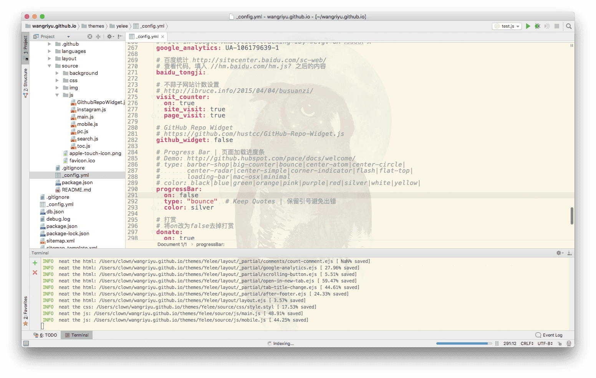
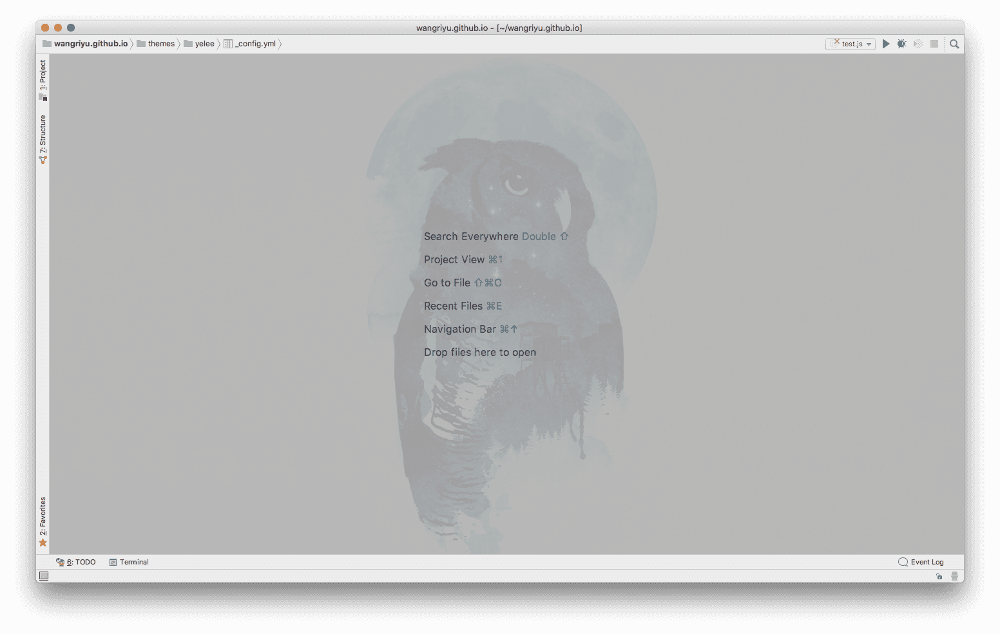
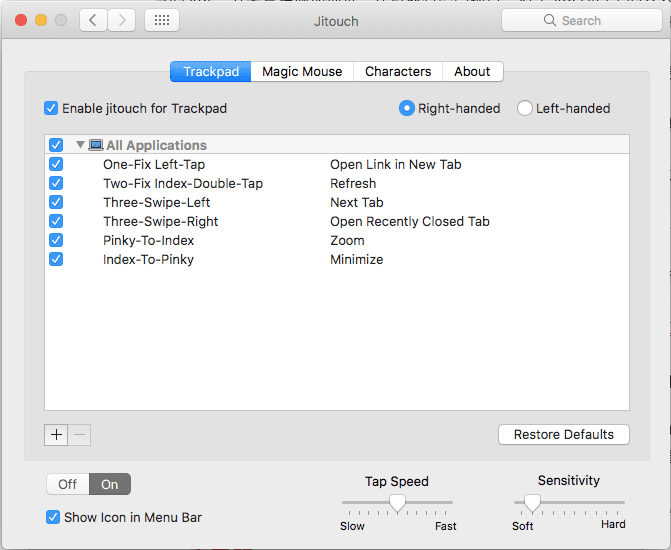
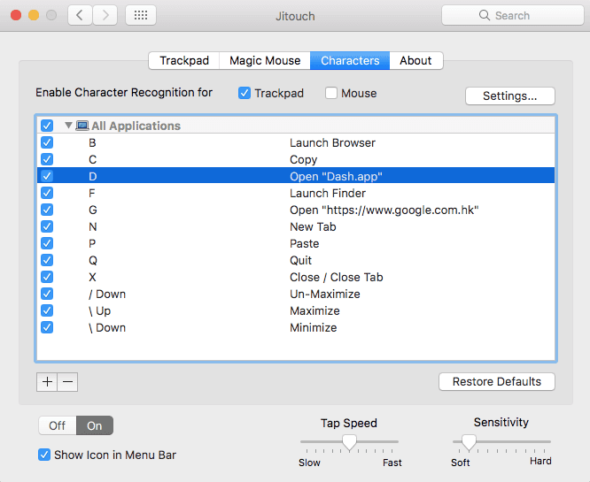

# Collections

整理自己的收藏

> 这些只是收录我现在用到的东西，没有特意收集的意思，未必很全，但每个应该都很实用

- [插件篇](#插件篇)
- [软件篇](#软件篇)
- [应用篇](#应用篇)
- [网站篇](#网站篇)
- [star篇](#star篇)

## 插件篇

### Chrome 插件

- Adblock Plus:：屏蔽广告，必备，不用介绍
- [Code Cola](https://chrome.google.com/webstore/detail/code-cola/lomkpheldlbkkfiifcbfifipaofnmnkn "点击访问")：一个可视化编辑在线页面css样式的chrome插件，相当于控制台修改的效果，但方便很多
- [Full Page Screen Capture](https://chrome.google.com/webstore/detail/full-page-screen-capture/fdpohaocaechififmbbbbbknoalclacl "点击访问")：可以滚动截取整个网页
- [划词翻译](https://chrome.google.com/webstore/detail/%E5%88%92%E8%AF%8D%E7%BF%BB%E8%AF%91/ikhdkkncnoglghljlkmcimlnlhkeamad)：划词翻译，支持谷歌、百度、有道翻译
- ★★[简阅](http://ksria.com/simpread/)：巨好用的插件，相当于添加了阅读模式，界面很漂亮，设置很全，功能也挺完整
- [Page Ruler](https://chrome.google.com/webstore/detail/page-ruler/jlpkojjdgbllmedoapgfodplfhcbnbpn "点击访问")：网页标尺，可以方便测量各个元素的尺寸
- ★[Web Developer](http://chrispederick.com/work/web-developer/ "点击访问")：前端必备，功能强大，可以设置网页上几乎所有东西
- ★★[WEB前端助手(FeHelper)](https://chrome.google.com/webstore/detail/web%E5%89%8D%E7%AB%AF%E5%8A%A9%E6%89%8Bfehelper/pkgccpejnmalmdinmhkkfafefagiiiad?utm_source=chrome-ntp-icon "点击访问")：也是前端必备，包括json美化、页面测试、编解码、代码美化压缩等等
- ★有道云笔记网页剪报：配合有道云笔记，方便收藏各种笔记、网页
- [Wide Github](https://chrome.google.com/webstore/detail/wide-github/kaalofacklcidaampbokdplbklpeldpj "点击访问")：加宽GitHub的页面内容，让你的GitHub网页显示更舒服
- [Sourcegraph for GitHub](https://chrome.google.com/webstore/detail/sourcegraph-for-github/dgjhfomjieaadpoljlnidmbgkdffpack "点击访问")：相当于一个IDE，直接查看GitHub上的仓库
- [Octotree](https://chrome.google.com/webstore/detail/octotree/bkhaagjahfmjljalopjnoealnfndnagc?hl=en-US "点击访问")：GitHub插件，极力推荐，在仓库左上角显示目录，直接点击文件跳转，不用一级级打开网页上的repo
- ★★[Insight.io for Github](https://chrome.google.com/webstore/detail/insightio-for-github/pmhfgjjhhomfplgmbalncpcohgeijonh "点击访问")：功能和Octotree类似，比Octotree略微高级点
- ★[Isometric Contributions](https://chrome.google.com/webstore/detail/isometric-contributions/mjoedlfflcchnleknnceiplgaeoegien "点击访问")：装逼利器，让GitHub profile页的提交记录立体化，跟gitee的效果差不多
- ★★[GitHub Plus](https://chrome.google.com/webstore/detail/github-plus/anlikcnbgdeidpacdbdljnabclhahhmd "点击访问")：极力推荐，显示仓库、文件大小，并提供单文件的下载
- [Lisen1](http://listen1.github.io/listen1 "点击访问")：很棒的一个音乐插件，还有客户端版本
- ★[Muzli](https://muz.li/ "点击访问")：集合了很多网站的最新更新，一站式阅读新闻和资讯，适合设计者和开发者
- [feedly](https://chrome.google.com/webstore/detail/feedly/hipbfijinpcgfogaopmgehiegacbhmob?utm_source=chrome-ntp-icon "点击访问")：一个webapp，可以收藏网址，主要用于RSS和博客订阅
- [stylish](https://userstyles.org/ "点击访问")：可以自定义浏览器主题样式，也可以安装别人的
- ★[AddToAny: Share Anywhere](https://chrome.google.com/webstore/detail/addtoany-share-anywhere/ffpgijchhhkhnokafdeklpllijgnbche "点击访问")：一个分享插件

### Terminal 插件

Terminal插件和vim插件没怎么试过.感兴趣的可以到这个网站看看：[Vim Awesome](https://vimawesome.com/)

这里有几个我用过的:

- ★★[Oh My ZSH](http://ohmyz.sh/)：方便个性化配置你的zsh
  加个ys主题，换个字体，再加个背景图片，逼格立马上升了:
  
- [VimGameCodeBreak](https://github.com/johngrib/vim-game-code-break "点击访问")：打开一个文本，开始一盘打方块游戏吧，注意需要vim8.0
- [gtop](https://github.com/aksakalli/gtop "点击访问")：在终端显示电脑cpu、内存、进程信息

### VS Code 插件

更多vsc插件可以到官方市场搜索https://marketplace.visualstudio.com/search?target=VSCode&category=All%20categories&sortBy=Downloads

- [Active File In Status Bar](https://marketplace.visualstudio.com/items?itemName=RoscoP.ActiveFileInStatusBar)：在底部显示文档绝对路径
- [Auto Close Tag](https://marketplace.visualstudio.com/items?itemName=formulahendry.auto-close-tag)：自动补全关闭的标签，比如

- [Auto Rename Tag](https://marketplace.visualstudio.com/items?itemName=formulahendry.auto-rename-tag)：当你修改标签头时，同时修改标签尾
- [Bracket Pair Colorizer](https://marketplace.visualstudio.com/items?itemName=CoenraadS.bracket-pair-colorizer)：给各个括号添加颜色
- [Debugger for Chrome](https://marketplace.visualstudio.com/items?itemName=msjsdiag.debugger-for-chrome)：在Google Chrome浏览器调试JavaScript代码
- [ESLint](https://marketplace.visualstudio.com/items?itemName=dbaeumer.vscode-eslint)：代码检查工具
- [npm Intellisense](https://marketplace.visualstudio.com/items?itemName=christian-kohler.npm-intellisense)：在 import 导入语句中自动完成npm 模块
- [filesize](https://marketplace.visualstudio.com/items?itemName=mkxml.vscode-filesize)：显示文件大小
- [Material Icon Theme](https://marketplace.visualstudio.com/items?itemName=PKief.material-icon-theme)：提供MD风格的文档图标
- [Path Intellisense](https://marketplace.visualstudio.com/items?itemName=christian-kohler.path-intellisense)：路径自动补全
- [Preview](https://marketplace.visualstudio.com/items?itemName=searKing.preview-vscode)：提供Markdown, ReStructured Text, HTML, Jade, Pug, Mermaid files, Image's URI or CSS properties的预览，MAC快捷键:cmd+shift+v
- [Word Count](https://marketplace.visualstudio.com/items?itemName=DoubleWoodH.word-count)：字数统计，同事写的
- [Git Easy](https://marketplace.visualstudio.com/items?itemName=bibhasdn.git-easy)：让git更方便
- [JavaScript (ES6) code snippets](https://marketplace.visualstudio.com/items?itemName=xabikos.JavaScriptSnippets)：代码片段插件，支持js和ts，比如输入imp生成import fs from 'fs';
- [Document This](https://marketplace.visualstudio.com/items?itemName=joelday.docthis)：自动给js代码添加注释
- [Prettier](https://marketplace.visualstudio.com/items?itemName=esbenp.prettier-vscode)：格式化js代码，快捷键`cmd + shift + p`输入Format Document或Format Selection(先选中要格式化的文本)

### IDE插件

分享两个JetBrains的插件，无意间看到的

- [Background Image Plus](https://plugins.jetbrains.com/plugin/8502-background-image-plus): 设置背景图片的，效果如下
  
  
- [activate-power-mode](https://plugins.jetbrains.com/plugin/8330-activate-power-mode): 这原本是Atom的插件，移植过来的，效果还行吧，但是这东西华而不实，如果影响打字还是去掉得好。还有如果安装后发现没有效果，记得把combo那个选项去掉，因为默认要连击多少下才会出效果

## 软件篇

- ★[PDF Expert](https://pdfexpert.com/ "点击访问")：mac上最好用最强大的pdf软件，如果资金有限不想购买的客官可以看下[Xclient.info](http://xclient.info/s/pdf-expert-for-mac.html?_=f7d710b8833dbc76de5d7640956a0551 "点击访问")
- ★★[Typora](https://typora.io/ "点击访问")：方便快速地编写MarkDown，界面简单，实用高效
- ★[NetWorker](https://itunes.apple.com/cn/app/networker-%E6%98%BE%E7%A4%BA%E7%BD%91%E7%BB%9C%E4%BF%A1%E6%81%AF/id1163602886?mt=12 "点击访问")：状态栏显示网速，简单美观
- ★[iStatistica](https://itunes.apple.com/us/app/istatistica/id1025822138?mt=12)：一款颜值颇高的系统监控软件，它包括通知中心小部件和状态栏菜单
  
- ★[Sip](https://sipapp.io/ "点击访问")：很好用的取色工具，需要购买，如果资金有限不想购买的客官可以看下[Xclient.info](http://xclient.info/s/sip.html?_=f7d710b8833dbc76de5d7640956a0551 "点击访问")
- ★★[FastStone Capture](http://faststone.org/FSCaptureDetail.htm "点击访问")：Windows上一款非常强大的集取色截屏录屏于一身的软件，而且支持滚动截屏，可惜mac上没有
- ★★[有道云笔记](https://note.youdao.com/ "点击访问")：收藏编写笔记很方便，配合浏览器插件可以收藏网页，关注官方公众号还可以把微信文章也收藏进去，我的所有收藏和笔记都可以放进去，而且多端同步随时可以看，手机版还可以写markdown
- [Snip](http://snip.qq.com/ "点击访问")：之前找mac上支持滚动截屏的软件，但没找到很好的能代替Windows平台利器FastStone的，这个Snip勉强符合滚动截屏的要求
- ★[Jietu](http://jietu.qq.com "点击访问")：和snip一样同出于鹅厂，也有滚动截屏，功能多一点，可以代替snip
- ★[MindNode](https://itunes.apple.com/app/id992076693?mt=12&ign-mpt=uo%3D4 "点击访问")：很漂亮的一款思维导图，如果资金有限不想购买的客官可以看下[Xclient.info](http://xclient.info/s/mind-node-pro.html?_=f7d710b8833dbc76de5d7640956a0551 "点击访问")
- [Expressions](https://itunes.apple.com/cn/app/expressions/id913158085?l=en&mt=12 "点击访问")：一款macOS平台的强大的正则表达式工具，测试正则表达式，多种主题，选中高亮等。如果资金有限不想购买的客官可以看下[Xclient.info](http://xclient.info/s/expressions.html?_=f7d710b8833dbc76de5d7640956a0551 "点击访问")
- [WebTorrent](https://webtorrent.io/desktop/ "点击访问")：直接看磁链里的内容，无需等待下载
- [Framer](https://framer.com/features/ "点击访问")：一个设计开发用的
- [Tumult](http://tumult.com/hype/pro/ "点击访问")：也是一个设计工具，还没用过
- ★[New File Menu](http://xclient.info/s/new-file-menu.html?_=8f2ea7453a409bd6674c05d22079f675 "点击访问")：finder扩展，右键新建文件，还可以自定义文件模板
- ★★[FDM](https://www.freedownloadmanager.org/)：全称free download manager，相当于免费的idm，而且支持mac平台，支持下载youtubu视频，支持url或者torrent，我还试了下mac平台另一款网上推荐的下载工具folx，但folx速度好像比不上fdm
- ★[Entropy](http://www.eigenlogik.com/entropy/)：很强大的解压缩软件，支持多种格式，操作便捷，但收费，如果资金有限不想购买的客官可以看下[xclient.info](http://xclient.info/s/entropy.html?_=38c50d7151e1cd2d16ca86daef7039c2)
- ★[Leaf](https://itunes.apple.com/cn/app/leaf-rss-news-reader/id576338668?l=en&mt=12)：RSS News Reader, 订阅RSS源后，可以一站式阅读，之前不知道rss这东西，傻傻地一个个打开别人博客看文章
  这里有一些收藏的RSS源: [javascriptweekly](http://javascriptweekly.com/rss/13jbi2ol)、[CSDN博客推荐文章](http://blog.csdn.net/rss.html)、[阮一峰的网络日志](http://www.ruanyifeng.com/blog/atom.xml)、[小胡子哥](http://www.barretlee.com/rss2.xml)、[酷壳](https://coolshell.cn/feed)、[张鑫旭](http://www.zhangxinxu.com/wordpress/feed/)、[前端开发博客](http://caibaojian.com/feed)、[Harttle Land](http://harttle.com/feed.xml)、[Phodal - A Growth Engineer](https://www.phodal.com/blog/feeds/rss/)、
  [Web技术研究所](https://www.web-tinker.com/rss.xml)、[三水清](http://js8.in/atom.xml)、[刘彦玮](http://liuyanwei.jumppo.com/pages/rss.xml)、[ChokCoco](http://feed.cnblogs.com/blog/u/177636/rss)、[小士刀](http://wdxtub.com/atom.xml)、[贾鹏辉](http://www.devio.org/feed.xml)、[颜海镜](http://yanhaijing.com/rss.xml)、[干货集中营](http://gank.io/feed)、[奇舞周刊](https://weekly.75team.com/rss.php)、
  [码农周刊](http://blog.manong.io/rss.xml)、[InfoQ](http://www.infoq.com/cn/feed)、[OneTwo](http://onetwo.ren//feed.xml)
- [Bootstrap Studio](https://bootstrapstudio.io/ "点击访问")：这个软件可牛逼了，建议看下官网的介绍视频，这个软件可以让你以直接拖动组件的方式完成一个网页，感觉跟C#类似，用来做基础布局可以节约大量时间
- ★[智图](https://zhitu.isux.us/ "点击访问")：图片压缩，方便快捷
- [萤火虫Firefly](https://github.com/yinghuocho/firefly-proxy "点击访问")：一款翻墙软件，电脑手机都有
- [蓝灯](https://github.com/getlantern/lantern "点击访问")：蓝灯VPN，速度挺快的，如果下载发行版的话有流量限制，建议去GitHub上照步骤自己编译程序，这样是没有流量限制的
- [ThunnelBear](https://www.tunnelbear.com/)：ThunnelBear VPN，速度还行，分享推特后每月有1GB流量
- [XX-Net](https://github.com/XX-net/XX-Net "点击访问")：很好用的翻墙工具，但配置会麻烦一点
- [HandShaker](http://www.smartisan.com/apps/handshaker)：锤子科技出的一款软件，可以无线连接手机和电脑，方便在电脑上管理移动设备的文件，如果要互传可以使用茄子快传
- ★★[Dash](https://kapeli.com/dash "点击访问")：开发者必备，各种API文档，配合Alfred查询非常方便，如果资金有限不想购买的客官可以看下[Xclient.info](http://xclient.info/s/dash.html?_=f7d710b8833dbc76de5d7640956a0551 "点击访问")
- [xScope](http://xscopeapp.com "点击访问")：设计开发辅助工具，有10个实用优秀的小工具，如屏幕镜像、屏幕标尺、放大镜、十字定位等等
- ★★[ohMyStar2](https://itunes.apple.com/cn/app/ohmystar2-best-way-to-organize-your-github-stars/id1218642292?l=en&mt=12 "点击访问")：强烈推荐的一个软件，可以管理GitHub账号的star，分类管理添加标签，还可以看热门项目，对于star几百个的人太有用了
- ★[gitee](https://github.com/Nightonke/Gitee "点击访问")：显示GitHub账号信息，方便查看trending、项目信息等
- ★[Slack](https://slack.com/ "点击访问")：开发人员的聊天app，主要是国外用户，加入不同的channel，了解不同的地域风格，与国外友人交流
- [Gitter](http://gitter.im "点击访问")：也是一款开发人员地聊天app，集合各种语言和框架，与其相关的还有一个GitLab
- ★★★[Jitouch](http://www.jitouch.com/)：手势拓展，定义手势操作让触控板更强大，加上alfred，还要什么鼠标。这是我的设置，注意手势要求两指有一定距离，最好用食指和无名指来划。

- ★★[BetterTouchTool](https://www.boastr.net/)：功能比jitouch还要强大，但现在要收费，虽然功能更多而且支持自定义手势但设置也会复杂一点，这里有篇[教程](http://www.jianshu.com/p/4447344fc531)，对我来说jitouch已经够用了
- ★★★[Alfred](https://www.alfredapp.com/ "点击访问")：如果上面的都是神器，那这个就是超神器，强烈推荐。附上[使用教程](http://wellsnake.com/jekyll/update/2014/06/15/001/ "点击访问")。
  建议关掉mac自带的Spotlight, 将Alfred快捷键设置成cmd + space(原Spotlight快捷键)；
  把常用的网站，特别是搜索类的放到websearch里：
  
  把浏览器书签导入Safari，可以用Alfred搜索打开；快捷键打开终端；查询文档；搜索打开文件；记录Clipboard历史等等...
  当然最强大的功能还是workflow，我用到的workflow有Chrome书签、Dash和有道翻译

## 应用篇

本人手机安卓，所以只推荐一些自用的安卓应用

- [Google Play]：第一推荐当然是谷歌商店啦，上面也有很多精品应用
- [蓝灯VPN]：要访问谷歌肯定要翻墙，蓝灯还是能用的，之前用的是green，但后来又被封了
- [萤火虫VPN]：萤火虫也是可以用的
- ★★[知乎、简书、轻氧、掘金、开发者头条]：学习的好地方
- [FastHub](https://play.google.com/store/apps/details?id=com.fastaccess.github)：FastHub for GitHub，集合了GitHub基本所需的所有功能
- [最美应用](http://zuimeia.com/apps/?platform=2 "点击访问")：这是一个应用的名字，是最美团队出品的，收集了很多精品应用
- [Flipboard](https://play.google.com/store/apps/details?id=flipboard.app&hl=zh_CN "点击访问")：需要翻墙，一些时事资讯。热门文章等
- [ZUI Days](https://play.google.com/store/apps/details?id=com.zuiapps.suite.days&hl=zh_CN "点击访问")：一款很漂亮的记录时间和重要纪念日的应用
- ★[即刻](https://play.google.com/store/apps/details?id=com.ruguoapp.jike&hl=zh_CN "点击访问")：专门为你定制的内容推送，推荐使用
- [Google Spotlight Stories](https://play.google.com/store/apps/details?id=com.google.android.spotlightstories&hl=zh_CN "点击访问")：用手机看真•3D视频，效果很棒，值得一试
- ★[Memorado](https://play.google.com/store/apps/details?id=com.memorado.brain.games&hl=zh_CN "点击访问")：很棒的一款脑力游戏，画面精美，无聊的时候练练脑力
- [PicsArt](https://play.google.com/store/apps/details?id=com.picsart.studio&hl=zh_CN "点击访问")：很强大的修图应用，但让我印象深刻的是里面的魔法：可以将一张图转换成其他图片的风格，比如梵高的星夜
- [Designer Tools](https://play.google.com/store/apps/details?id=com.scheffsblend.designertools&hl=zh_CN "点击访问")：设计师工具，提供了网格覆盖图、样机覆盖图、取色器、截图细节等
- [Curiosity](https://play.google.com/store/apps/details?id=com.curiosity.dailycuriosity&hl=zh_CN "点击访问")：各种视频，了解世界，增长见识
- ★★[Via浏览器](https://play.google.com/store/apps/details?id=mark.via.gp&hl=zh_CN "点击访问")：非常小巧的浏览器，但功能一应俱全，而且响应速度很快，类似的还有一个夸克浏览器
- ★[ADM]:安卓上的IDM，配合ES文件浏览器还可以下载百度网盘的东西，具体教程可以在网上搜到

## 网站篇

- ★[Xclient](http://xclient.info "点击访问")：精品mac应用分享
- ★[Devdocs](http://devdocs.io/ "点击访问")：API文档，功能和Dash差不多
- [印记中文](https://www.docschina.org/ "点击访问")：一些权威中文文档
- ★★[HtmlPreview](https://htmlpreview.github.io/ "点击访问")：HTML链接预览，可以用于预览github上的html文件
- ★★[在线压缩视频ClipChamp](https://clipchamp.com/zh-Hans/dashboard "点击访问")：方便好用
- [converticon](https://converticon.com/)：图片转icon
- [视频转换器](https://ezgif.com/video-to-gif "点击访问")：视频转GIF，压缩、裁剪等等
- ★[百度脑图](http://naotu.baidu.com/home "点击访问")：在线创建思维导图，功能强大
- ★[前端开发博客](http://caibaojian.com/page/3 "点击访问")：前端优质内容
- ★[干货集中营](http://gank.io/ "点击访问")：确实有干货，还有妹纸
- ★[tutorialzine](https://tutorialzine.com/articles "点击访问")：前端文章推送
- [Collect UI ](http://collectui.com/ "点击访问")：UI设计灵感
- [优设](http://www.uisdc.com/75-web-animation-tools-1# "点击访问")：关于设计和开发
- ★[CodePen](https://codepen.io/picks/2/ "点击访问")：各种有趣的js demo和项目
- [CodeSeek](https://www.codeseek.co/)：与CodePen类似的网站
- ★[Codrops](https://tympanus.net/codrops/category/playground/ "点击访问")：各种优质文章和设计
- ★★[CTOLib码库](https://www.ctolib.com/ "点击访问")：各种代码库
- [网易代码库](http://nec.netease.com/library "点击访问")
- ★[Dribbble](https://dribbble.com/ "点击访问")：优秀设计模板
- ★[Behance](https://www.behance.net/ "点击访问")：优秀设计创意作品
- ★[压缩图片https://tinypng.com](https://tinypng.com/ "点击访问")
- [在线画图Asciiflow](http://asciiflow.com/ "点击访问")
- [TheCodePlayer](http://thecodeplayer.com/ "点击访问")：很棒的HTML5、CSS3、JS学习网站，代码一行一行视频演示
- [Freshdesignweb](https://www.freshdesignweb.com/ "点击访问")：网站设计
- [CSS-Tricks](https://css-tricks.com/ "点击访问")：学习CSS不可错过此网站
- [JSRUN](http://en.jsrun.net/ "点击访问")：类似codepen，提供在线编写代码，也有很多有趣demo
- [CssDeck](http://cssdeck.com/ "点击访问")：一些展示CSS效果的demo
- ★[在线工具汇总](http://tool.oschina.net/ "点击访问")
- [觉唯设计](http://www.jiawin.com/10-design-artifact "点击访问")
- ★[SmashingMagazine](https://www.smashingmagazine.com/tag/javascript/ "点击访问")：前端杂志
- [NavNav](http://navnav.co/ "点击访问")：各种响应式菜单的设计
- [CODYHOUSE](https://codyhouse.co/library/ "点击访问")：视觉设计
- [CSS Wizardry Posts Archive](https://csswizardry.com/archive/ "点击访问")：优质博客文章，很多关于css和设计的
- [textify.it](http://textify.it/ "点击访问")：一个有趣的网站，可以把图片字符化
- [DeveloperDrive](http://www.developerdrive.com/categories/ "点击访问")：提供大量优质文章
- ★[HACKNOON](https://hackernoon.com/ "点击访问")：极客的下午茶时间，推送很多优质文章
- [假装 Windows 升级界面](http://fakeupdate.net/ "点击访问")
- [SeeSeed](https://www.seeseed.com/ "点击访问")：设计与灵感，适合设计师用
- [百度•图说](http://tushuo.baidu.com/wave/index#/gallery "点击访问")：在线创建图表
- [CSSWinner](http://www.csswinner.com/blog/ "点击访问")：CSS Award Gallery for Website Design Inspiration
- [众成翻译](http://www.zcfy.cc/translate/discovery "点击访问")：有很多翻译的和未翻译的文章，值得翻一翻看一看
- [果壳-科学人](http://www.guokr.com/scientific/ "点击访问")：挺多有趣的科学文章
- [Airbnb](https://zh.airbnb.com/ "点击访问")
- ★[Medium](https://medium.com/ "点击访问")：各种文章，谷歌商店上还能找到app
- [Google PageSpeed Tools](https://developers.google.com/speed/pagespeed/?hl=zh-CN&utm_source=PSI&utm_medium=incoming-link&utm_campaign=PSI "点击访问")：谷歌站点分析，网站速度性能评分
- [ARKie](http://www.arkie.cn/ "点击访问")：自动帮你设计海报，很好用
- ★[IconFont](http://iconfont.cn/ "点击访问")：阿里巴巴矢量图标库
- [PPT遥控器](http://ppt.baidu.com/ "点击访问")：用手机当ppt遥控器
- ★[Wordart](https://wordart.com/ "点击访问")：在线生成文字云
- [在线生成短链](https://goo.gl/# "点击访问")：谷歌在线生成短链工具
- ★[Gfycat](https://gfycat.com/ "点击访问")：各种动图
- [Mockups](https://mockupsjar.com/ "点击访问")：三步生成逼真的网站、手机的设计稿
- [ColorSpace](https://mycolor.space/gradient "点击访问")：生成渐进色背景
- ★[frontend.directory](https://frontend.directory/p "点击访问")：罗列了各种前端的资源
- [前端面试题](http://hawx1993.github.io/Front-end-Interview-Questions/#/?id=interview-quesetions "点击访问")：长期更新的，内容挺全
- [FKS](http://html5ify.com/fks/ "点击访问")：Frontend Knowledge Structure，前端知识体系汇总
- [CSS3PIE](http://css3pie.com/ "点击访问")：PIE使IE6~9可以支持大部分CSS3的样式
- [img2css](https://javier.xyz/img2css/ "点击访问")：将图片转成css，适合一些小图标，大图就不要尝试了
- [Trello](https://trello.com/# "点击访问")：看板，GitHub上有一个类似的项目叫[wekan](https://wekan.indie.host/ "点击访问")
- [BootCDN](http://www.bootcdn.cn/ "点击访问")：找一些库的cdn很方便
- [云真机](http://wetest.qq.com/product/cloudphone "点击访问")：腾讯推出的服务，可以线上测试各种手机
- ★[码农头条](http://hao.caibaojian.com/ "点击访问")
- ★[码农周刊](http://weekly.manong.io/issues/ "点击访问")
- [CSS Animate](http://cssanimate.com/ "点击访问")：在线生成css动画
- [外链工厂](http://www.wailian.work/ "点击访问")：无限外链，批量上传，而且可以生成各种嵌入代码
- [AlgorithmVisualizer](http://algo-visualizer.jasonpark.me/#path=backtracking/knight's_tour/basic "点击访问")：演示算法的网页，做的很棒
- ★[CodeWar](https://www.codewars.com "点击访问")：很适合练习编程，包含各种语言，而且可以查看别人对同一问题的不同解法
- [Visualizing Git Concepts with D3](http://onlywei.github.io/explain-git-with-d3/ "点击访问")：用图形化的教程教你使用一些基础的git命令
- [伯乐在线](http://www.jobbole.com/ "点击访问")
- [CreativeTim](https://www.creative-tim.com/ "点击访问")：很多网站和管理后台的模板
- ★[Carbon](https://carbon.now.sh/ "点击访问")：生成一张代码高亮图片，很漂亮，适合插入到网站和博客中
- [GitHub Resume](http://resume.github.io/ "点击访问")：输入github名，自动生成一个简单的简历页
- [js coach](https://js.coach/ "点击访问")：js开源库目录
- [前端周刊](http://www.feweekly.com/issues "点击访问")
- ★[EasyMock](https://www.easy-mock.com/login "点击访问")：更方便地模拟数据
- [MaterialIcon](https://material.io/icons/ "点击访问")：Material Design Icon
- [tutorialzine](https://tutorialzine.com/articles "点击访问")：前端文章
- ★[W3CPlus](http://www.w3cplus.com/ "点击访问")：w3cplus_引领web前沿，打造前端精品教程
- [HelloWeba](https://www.helloweba.com/ "点击访问")：又是前端文章
- [http://youarelistening.to](http://youarelistening.to/): 好像是在线听美国的广播电台，在知乎上看到的
- [http://geektyper.com](http://geektyper.com/)：随便乱敲，屏幕会显示一段一段代码或窗口，看起来跟黑客一样，纯属装逼
- [http://www.tuling123.com](http://www.tuling123.com/)：聊天机器人，可以接入公众号、qq、网页等
- [sentry.io](https://sentry.io/welcome/)：收集错误报告，帮助开发人员实时监控和修复崩溃
- ★[smallpdf](https://smallpdf.com/cn)：一站式处理pdf
- [overapi](http://overapi.com/)：各大语言和各种框架的API介绍
- [it-ebooks](http://www.it-ebooks.info/)：可以下载很多it相关的书籍
- [UI8](https://ui8.net/category/all)：很多设计模板
- ★[github hunter](http://repository-hunter.herokuapp.com)：统计github上的一些信息，可以查指定名字的信息，还有一些趣事集锦，还可以生成你的贡献图
- [HONGKIAT](http://www.hongkiat.com/blog/)：汇集各种设计和灵感
- ★★[Free Web Developer Tools by GigaBook](https://gigabook.com/tools)：各种网页开发工具，很全很强大
- [蓝湖 - 产品设计的协作平台](https://www.lanhuapp.com/)：适合团队设计
- [标你妹啊](http://www.biaonimeia.com/)：标你妹啊是新一代全自动化的标注工具，通过分析psd文件，自动创建图层、字体等元素的数据信息。
- [visualgo](https://visualgo.net)：演示算法
- [interviewcake](https://www.interviewcake.com/)：I will teach you to be good at programming interviews
- ★http://www.css88.com ：WEB前端开发 - 专注前端开发，关注用户体验 - 专注前端开发，关注用户体验
- http://www.jsnice.org ：反编译压缩的js代码，更容易阅读理解
- https://www.cloudboost.io :快速构建app
- [css3gen](https://css3gen.com/)：CSS3Gen可让您轻松生成有用的CSS3片段，并将其直接复制到您的项目中
- http://learningthreejs.com ：学习three.js
- http://javascript-puzzlers.herokuapp.com ：测试一下你是否真的懂了js，共44道题
- ★javascript周刊http://javascriptweekly.com/issues ：英文网站
- http://bennettfeely.com/cssynth ：生成卡片加载动画
- ★[css 生成渐变色代码](https://www.minimamente.com/example/gradient-generator/)
- ★[GTmetrix 网站测试](https://gtmetrix.com/)：对网站进行评估，并给出优化的建议
- ★[PageSpeed Tools 谷歌站点分析工具](https://developers.google.com/speed/pagespeed/insights/?hl=zh-CN)：也是对网站进行评估，并给出优化的建议
- [CodeBurst](https://codeburst.io/)：前端博客
- [Hitokoto - 一言](http://hitokoto.cn/)：一言指的就是一句话，可以是动漫中的台词，也可以是网络上的各种小段子。或是感动，或是开心，有或是单纯的回忆。
- [InvisionApp](https://www.invisionapp.com/feature/inspect?ref=muzli)：A magical new design to development workflow with Inspect
- [Webflow](https://webflow.com/)：Webflow gives designers and developers the power to design, build, and launch responsive websites visually, while writing clean, semantic code for you.
- [信任的进化](https://www.sekai.co/trust/)：有趣的游戏，通过博弈论来讲解"不信任"的原因
- [IPFS网络](https://ipfs.io/)：IPFS是一个点对点的超媒体协议，使网页更快，更安全，更开放。
- [DebugRun.com](http://www.debugrun.com/)：编程语言帮助文档 - 一个只有码农看得懂的网站

## star篇

> 下面这些是star的项目，用[starred](https://github.com/maguowei/starred)工具生成的
> > A curated list of my GitHub stars!  Generated by [starred](https://github.com/maguowei/starred)

## Contents

  - [C](#c)
  - [C#](#c#)
  - [C++](#c++)
  - [CSS](#css)
  - [CoffeeScript](#coffeescript)
  - [Dart](#dart)
  - [Go](#go)
  - [HTML](#html)
  - [Java](#java)
  - [JavaScript](#javascript)
  - [Kotlin](#kotlin)
  - [Lua](#lua)
  - [Makefile](#makefile)
  - [Objective-C](#objective-c)
  - [Others](#others)
  - [PHP](#php)
  - [Python](#python)
  - [Ruby](#ruby)
  - [Rust](#rust)
  - [Scala](#scala)
  - [Shell](#shell)
  - [Smarty](#smarty)
  - [Swift](#swift)
  - [TypeScript](#typescript)
  - [Vim script](#vimscript)
  - [Vue](#vue)

## C 

- [tengine](https://github.com/alibaba/tengine) - A distribution of Nginx with some advanced features
- [redis](https://github.com/antirez/redis) - Redis is an in-memory database that persists on disk. The data model is key-value, but many different kind of values are supported: Strings, Lists, Sets, Sorted Sets, Hashes, HyperLogLogs, Bitmaps.
- [emscripten](https://github.com/kripken/emscripten) - Emscripten: An LLVM-to-JavaScript Compiler
- [rufus](https://github.com/pbatard/rufus) - The Reliable USB Formatting Utility
- [reactos](https://github.com/reactos/reactos) - A free Windows-compatible Operating System
- [linux](https://github.com/torvalds/linux) - Linux kernel source tree
- [CSAPP](https://github.com/vonzhou/CSAPP) - CSAPP,《深入理解计算机系统结构》2nd ，阅读与实践！

## C# # 

- [react-native-windows](https://github.com/Microsoft/react-native-windows) - A framework for building native UWP and WPF apps with React.
- [Wox](https://github.com/Wox-launcher/Wox) - Launcher for Windows, an alternative to Alfred and Launchy.
- [NiceHashMiner](https://github.com/nicehash/NiceHashMiner) - NiceHash easy to use CPU&GPU Miner

## C++ 

- [Karabiner-Elements](https://github.com/tekezo/Karabiner-Elements) - Karabiner-Elements is a powerful utility for keyboard customization on macOS Sierra (10.12) or later.
- [v8](https://github.com/v8/v8) - The official mirror of the V8 Git repository
- [grpc](https://github.com/grpc/grpc) - The C based gRPC (C++, Python, Ruby, Objective-C, PHP, C#)
- [apollo](https://github.com/ApolloAuto/apollo) - An open autonomous driving platform
- [snappy](https://github.com/google/snappy) - A fast compressor/decompressor
- [protobuf](https://github.com/google/protobuf) - Protocol Buffers - Google's data interchange format
- [SmartDeblur](https://github.com/Y-Vladimir/SmartDeblur) - Restoration of defocused and blurred photos/images
- [phxqueue](https://github.com/Tencent/phxqueue) - A high-availability, high-throughput and highly reliable distributed queue based on the Paxos algorithm.
- [albert](https://github.com/albertlauncher/albert) - A fast and flexible keyboard launcher
- [wubiuefi](https://github.com/hakuna-m/wubiuefi) - fork of Wubi (https://launchpad.net/wubi) for UEFI support and for support of recent Ubuntu releases
- [C-Plus-Plus](https://github.com/TheAlgorithms/C-Plus-Plus) - All Algorithms implemented in C++
- [napajs](https://github.com/Microsoft/napajs) - Napa.js: a multi-threaded JavaScript runtime
- [bitcoin](https://github.com/bitcoin/bitcoin) - Bitcoin Core integration/staging tree
- [cosmos](https://github.com/OpenGenus/cosmos) - Algorithms that run our universe | Your personal library of every algorithm and data structure code that you will ever encounter
- [scribe](https://github.com/facebookarchive/scribe) - Scribe is a server for aggregating log data streamed in real time from a large number of servers.
- [Gource](https://github.com/acaudwell/Gource) - software version control visualization
- [brpc](https://github.com/brpc/brpc) - Industrial-grade RPC framework used throughout Baidu, with 600,000+ instances and 500+ kinds of services, called "baidu-rpc" inside Baidu.
- [butteraugli](https://github.com/google/butteraugli) - butteraugli estimates the psychovisual difference between two images
- [tensorflow](https://github.com/tensorflow/tensorflow) - Computation using data flow graphs for scalable machine learning
- [NuoModelViewer](https://github.com/middlefeng/NuoModelViewer) - A simple Wavefront OBJ viewer.
- [electron](https://github.com/electron/electron) - Build cross platform desktop apps with JavaScript, HTML, and CSS
- [rainmeter](https://github.com/rainmeter/rainmeter) - Desktop customization tool for Windows

## CSS 

- [instagram.css](https://github.com/picturepan2/instagram.css) - Complete set of Instagram filters in pure CSS
- [2048](https://github.com/gabrielecirulli/2048) - A small clone of 1024 (https://play.google.com/store/apps/details?id=com.veewo.a1024)
- [CSSGlitchEffect](https://github.com/codrops/CSSGlitchEffect) - An experimental glitch effect powered by CSS animations and the clip-path property. Inspired by the technique seen on the speakers page of the 404 conference.
- [gobyexample](https://github.com/mmcgrana/gobyexample) - Go by Example
- [iziModal](https://github.com/dolce/iziModal) - Elegant, responsive, flexible and lightweight modal plugin with jQuery.
- [bulma](https://github.com/jgthms/bulma) - Modern CSS framework based on Flexbox
- [spectre](https://github.com/picturepan2/spectre) - Spectre.css - a Lightweight, Responsive and Modern CSS Framework
- [voxel.css](https://github.com/HunterLarco/voxel.css) - A lightweight 3D CSS voxel library.
- [cPlayer](https://github.com/MoePlayer/cPlayer) - A beautiful and clean WEB Music Player by HTML5.
- [Hover-Buttons](https://github.com/Varin6/Hover-Buttons) - Animated CSS/SCSS Buttons
- [hacker-news-pwas](https://github.com/tastejs/hacker-news-pwas) - HNPWA - Hacker News readers as Progressive Web Apps 📱
- [odometer](https://github.com/HubSpot/odometer) - Smoothly transitions numbers with ease. #hubspot-open-source
- [css-loaders](https://github.com/lukehaas/css-loaders) - A collection of loading spinners animated with CSS
- [now-ui-kit](https://github.com/creativetimofficial/now-ui-kit) - Now UI Kit Bootstrap 4 - Designed by Invision. Coded by Creative Tim
- [light-bootstrap-dashboard-react](https://github.com/creativetimofficial/light-bootstrap-dashboard-react) - React version of Light Bootstrap Dashboard
- [zepto.fullpage](https://github.com/yanhaijing/zepto.fullpage) - 专注于移动端的fullPage.js
- [primer](https://github.com/primer/primer) - The design system that powers GitHub
- [devices.css](https://github.com/picturepan2/devices.css) - Devices.css - Modern devices in pure CSS
- [bounce.js](https://github.com/tictail/bounce.js) - Create beautiful CSS3 powered animations in no time.
- [magic](https://github.com/miniMAC/magic) - CSS3 Animations with special effects
- [hexo-theme-yelee](https://github.com/MOxFIVE/hexo-theme-yelee) - 简而不减 Hexo 双栏博客主题; Another simple and elegant theme for Hexo.
- [animate.css](https://github.com/daneden/animate.css) - 🍿 A cross-browser library of CSS animations. As easy to use as an easy thing.
- [hexo-theme-ambition](https://github.com/eynol/hexo-theme-ambition) - Yellow & black color style. Clean. Pure reading experience.
- [bootstrap](https://github.com/twbs/bootstrap) - The most popular HTML, CSS, and JavaScript framework for developing responsive, mobile first projects on the web.

## CoffeeScript 

- [dynamics.js](https://github.com/michaelvillar/dynamics.js) - Javascript library to create physics-based animations

## Dart 

- [sysui](https://github.com/fuchsia-mirror/sysui) - 
- [stream](https://github.com/rikulo/stream) - Lightweight Dart web server. Features: request routing, filtering, template engine, WebSocket, MVC design pattern, and file-based static resources.
- [lottie-flutter](https://github.com/fabiomsr/lottie-flutter) - 
- [flutter_markdown](https://github.com/flutter/flutter_markdown) - A markdown renderer for Flutter.
- [fluro](https://github.com/goposse/fluro) - The brightest, hippest, coolest router for Flutter.
- [Flutter-StepByStep](https://github.com/fabiomsr/Flutter-StepByStep) - A example of an Android / iOS app written using Google Flutter with MVP architecture
- [flutter](https://github.com/flutter/flutter) - Flutter makes it easy and fast to build beautiful mobile apps.

## Go 

- [gobot](https://github.com/hybridgroup/gobot) - Golang framework for robotics, drones, and the Internet of Things (IoT)
- [grpc-go](https://github.com/grpc/grpc-go) - The Go language implementation of gRPC. HTTP/2 based RPC
- [base64Captcha](https://github.com/mojocn/base64Captcha) - golang base64-captcha supports digits, numbers,alphabet, arithmetic, audio and digit-alphabet captcha.图形验证码
- [2048-ai](https://github.com/xwjdsh/2048-ai) - An simple AI for the 2048 game.
- [jwt-go](https://github.com/dgrijalva/jwt-go) - Golang implementation of JSON Web Tokens (JWT)
- [minio-go](https://github.com/minio/minio-go) - Minio Client SDK for Go
- [goleveldb](https://github.com/syndtr/goleveldb) - LevelDB key/value database in Go.
- [hyperloglog](https://github.com/clarkduvall/hyperloglog) - HyperLogLog and HyperLogLog++ implementation in Go/Golang.
- [websocketd](https://github.com/joewalnes/websocketd) - Turn any program that uses STDIN/STDOUT into a WebSocket server. Like inetd, but for WebSockets.
- [snappy](https://github.com/golang/snappy) - The Snappy compression format in the Go programming language.
- [groupcache](https://github.com/golang/groupcache) - groupcache is a caching and cache-filling library, intended as a replacement for memcached in many cases.
- [websocket](https://github.com/gorilla/websocket) - A WebSocket implementation for Go.
- [badger](https://github.com/dgraph-io/badger) - Fast key-value DB in Go.
- [minikube](https://github.com/kubernetes/minikube) - Run Kubernetes locally
- [go.uuid](https://github.com/satori/go.uuid) - UUID package for Go
- [mux](https://github.com/gorilla/mux) - A powerful URL router and dispatcher for golang.
- [traefik](https://github.com/containous/traefik) - Træfik, a modern reverse proxy
- [xorm](https://github.com/go-xorm/xorm) - Simple and Powerful ORM for Go, support mysql,postgres,tidb,sqlite3,mssql,oracle
- [go-web-foundation](https://github.com/Unknwon/go-web-foundation) - 《Go Web 基础》是一套针对 Google 出品的 Go 语言的视频语音教程，主要面向完成《Go 编程基础》教程后希望进一步了解有关 Go Web 开发的学习者。
- [the-way-to-go_ZH_CN](https://github.com/Unknwon/the-way-to-go_ZH_CN) - 《The Way to Go》中文译本，中文正式名《Go入门指南》
- [git-lfs](https://github.com/git-lfs/git-lfs) - Git extension for versioning large files
- [qor](https://github.com/qor/qor) - QOR is a set of libraries written in Go that abstracts common features needed for business applications, CMSs, and E-commerce systems.
- [wemall](https://github.com/shen100/wemall) - 基于react, node.js, go开发的微商城（含微信小程序）
- [pholcus](https://github.com/henrylee2cn/pholcus) - [Crawler for Golang] Pholcus is a distributed, high concurrency and powerful web crawler software.
- [cobra](https://github.com/spf13/cobra) - A Commander for modern Go CLI interactions
- [delve](https://github.com/derekparker/delve) - Delve is a debugger for the Go programming language.
- [influxdb](https://github.com/influxdata/influxdb) - Scalable datastore for metrics, events, and real-time analytics
- [etcd](https://github.com/coreos/etcd) - Distributed reliable key-value store for the most critical data of a distributed system
- [hugo](https://github.com/gohugoio/hugo) - The world’s fastest framework for building websites.
- [moby](https://github.com/moby/moby) - Moby Project - a collaborative project for the container ecosystem to assemble container-based systems
- [vice](https://github.com/matryer/vice) - Go channels at horizontal scale (powered by message queues)
- [joy](https://github.com/matthewmueller/joy) - A delightful Go to Javascript compiler
- [iris](https://github.com/kataras/iris) - :gift: Happy New Year: Version 10 released. The fastest web framework for Go in the Universe.
- [go-github](https://github.com/google/go-github) - Go library for accessing the GitHub API
- [netstack](https://github.com/google/netstack) - IPv4 and IPv6 userland network stack
- [apex](https://github.com/apex/apex) - Build, deploy, and manage AWS Lambda functions with ease (with Go support!).
- [spread](https://github.com/redspread/spread) - Docker to Kubernetes in one command
- [go-astilectron](https://github.com/asticode/go-astilectron) - Build cross platform GUI apps with GO and HTML/JS/CSS (powered by Electron)
- [go-astilectron-demo](https://github.com/asticode/go-astilectron-demo) - Discover the power of Astilectron through a demo app
- [chat](https://github.com/tinode/chat) - Instant messaging server; backend in Go, Android and web clients, gRPC transport
- [mobile](https://github.com/golang/mobile) - [mirror] Go on Mobile
- [drone](https://github.com/drone/drone) - Drone is a Continuous Delivery platform built on Docker, written in Go
- [go-ipfs](https://github.com/ipfs/go-ipfs) - IPFS implementation in go
- [go-patterns](https://github.com/tmrts/go-patterns) - Curated list of Go design patterns, recipes and idioms
- [pouch](https://github.com/alibaba/pouch) - Pouch is an open-source project created to promote the container technology movement.
- [golang123](https://github.com/shen100/golang123) - golang123 是使用 vue、nuxt、node.js 和 golang 开发的社区系统
- [gofpdf](https://github.com/jung-kurt/gofpdf) - A PDF document generator with high level support for text, drawing and images
- [The-Golang-Standard-Library-by-Example](https://github.com/polaris1119/The-Golang-Standard-Library-by-Example) - Golang标准库。对于程序员而言，标准库与语言本身同样重要，它好比一个百宝箱，能为各种常见的任务提供完美的解决方案。以示例驱动的方式讲解Golang的标准库。
- [glide](https://github.com/Masterminds/glide) - Package Management for Golang
- [wukong](https://github.com/huichen/wukong) - 高度可定制的全文搜索引擎
- [mysql](https://github.com/go-sql-driver/mysql) - Go MySQL Driver is a MySQL driver for Go's (golang) database/sql package
- [goim](https://github.com/Terry-Mao/goim) - goim
- [ShopApi](https://github.com/TechCatsLab/ShopApi) - Some api for a shop app, use golang and echo framework.
- [mgo](https://github.com/go-mgo/mgo) - The MongoDB driver for Go. See http://labix.org/mgo for details.
- [gorm](https://github.com/jinzhu/gorm) - The fantastic ORM library for Golang, aims to be developer friendly
- [Go](https://github.com/TheAlgorithms/Go) - Algorithms Implemented in GoLang
- [echo](https://github.com/labstack/echo) - High performance, minimalist Go web framework
- [flux](https://github.com/weaveworks/flux) - A tool for deploying container images to Kubernetes services
- [k8s](https://github.com/tensorflow/k8s) - Tools for ML/Tensorflow on Kubernetes.
- [go-pcurl](https://github.com/thimoonxy/go-pcurl) - cURL in parallel way, Written in golang
- [go](https://github.com/golang/go) - The Go programming language
- [NeteaseCloudMusicFlac](https://github.com/lifei6671/NeteaseCloudMusicFlac) - 根据网易云音乐的歌单, 下载flac无损音乐到本地.。
- [killy](https://github.com/prism-river/killy) - 🎮 🆓 Play TiDB in Minecraft!
- [tidb](https://github.com/pingcap/tidb) - TiDB is a distributed HTAP database compatible with MySQL protocol
- [up](https://github.com/apex/up) - Deploy infinitely scalable serverless apps, apis, and sites in seconds to AWS.
- [go-ethereum](https://github.com/ethereum/go-ethereum) - Official Go implementation of the Ethereum protocol
- [blockchain_guide](https://github.com/yeasy/blockchain_guide) - Introduce blockchain related technologies, from theory to practice with bitcoin, ethereum and hyperledger.
- [gopherjs](https://github.com/gopherjs/gopherjs) - A compiler from Go to JavaScript for running Go code in a browser
- [fn](https://github.com/fnproject/fn) - The container native, cloud agnostic serverless platform.
- [matcha](https://github.com/gomatcha/matcha) - Build native mobile apps in Go.
- [build-your-own-docker](https://github.com/xf0rk/build-your-own-docker) - 自己动手写Docker
- [mydocker](https://github.com/xianlubird/mydocker) - &lt;&lt;自己动手写docker&gt;&gt; 源码
- [beego](https://github.com/astaxie/beego) - beego is an open-source, high-performance web framework for the Go programming language.
- [kubernetes](https://github.com/kubernetes/kubernetes) - Production-Grade Container Scheduling and Management
- [draft](https://github.com/Azure/draft) - A tool for developers to create cloud-native applications on Kubernetes.
- [gosnippet](https://github.com/TechCatsLab/gosnippet) - Go 深入学习
- [lantern](https://github.com/getlantern/lantern) - 🔴Lantern Latest Download https://github.com/getlantern/lantern/releases/tag/latest 🔴蓝灯最新版本下载 https://github.com/getlantern/forum/issues/833 🔴
- [blockchain_go](https://github.com/Jeiwan/blockchain_go) - A simplified blockchain implementation in Golang
- [awesome-go](https://github.com/avelino/awesome-go) - A curated list of awesome Go frameworks, libraries and software
- [ERP](https://github.com/hexiaoyun128/ERP) - 基于beego的进销存系统
- [firefly-proxy](https://github.com/yinghuocho/firefly-proxy) - A proxy software to help circumventing the Great Firewall.
- [kubeless](https://github.com/kubeless/kubeless) - Kubernetes Native Serverless Framework
- [google-api-go-client](https://github.com/sunanxiang/google-api-go-client) - Auto-generated Google APIs for Go
- [MD5-decode-violently](https://github.com/sunanxiang/MD5-decode-violently) - decode MD5 with a violent way
- [baidu-ai-go-sdk](https://github.com/chenqinghe/baidu-ai-go-sdk) - 百度AI服务go语言sdk
- [golangdoc.translations](https://github.com/golang-china/golangdoc.translations) - Go语言文档翻译文件
- [go-fundamental-programming](https://github.com/Unknwon/go-fundamental-programming) - 《Go 编程基础》是一套针对 Google 出品的 Go 语言的视频语音教程，主要面向新手级别的学习者。
- [build-web-application-with-golang](https://github.com/astaxie/build-web-application-with-golang) - A golang ebook intro how to build a web with golang

## HTML 

- [DialogEffects](https://github.com/codrops/DialogEffects) - A collection of dialog effects using CSS (and SVG) animations.
- [MenuHoverEffects](https://github.com/codrops/MenuHoverEffects) - Some inspiration for menu hover effects.
- [Rocket.Chat.Electron](https://github.com/RocketChat/Rocket.Chat.Electron) - Official  OSX, Windows, and Linux Desktop Clients for Rocket.Chat
- [serverless](https://github.com/phodal/serverless) - Serverless 架构应用开发指南 - Serverless Architecture Application Development Guide with Serverless Framework.
- [shape-overlays](https://github.com/ykob/shape-overlays) - Multi-layered SVG shape overlays with adjustable values for a variety of effects. By Yoichi Kobayashi.
- [screenfull.js](https://github.com/sindresorhus/screenfull.js) - Simple wrapper for cross-browser usage of the JavaScript Fullscreen API
- [papillon](https://github.com/gogank/papillon) - A distributed blog publish system based on IPFS
- [skrollr](https://github.com/Prinzhorn/skrollr) - Stand-alone parallax scrolling library for mobile (Android + iOS) and desktop. No jQuery. Just plain JavaScript (and some love).
- [HTML5_Audio_Visualizer](https://github.com/wayou/HTML5_Audio_Visualizer) - An audio spectrum visualizer built with HTML5 Audio API
- [growth-ebook](https://github.com/phodal/growth-ebook) - Growth Engineering: The Definitive Guide。全栈增长工程师指南
- [material-design-lite](https://github.com/google/material-design-lite) - Material Design Components in HTML/CSS/JS
- [AdminLTE](https://github.com/almasaeed2010/AdminLTE) - AdminLTE - Free Premium Admin control Panel Theme Based On Bootstrap 3.x
- [cockroachdb_docs_cn](https://github.com/TechCatsLab/cockroachdb_docs_cn) - CockroachDB 文档中文翻译
- [node-interview](https://github.com/ElemeFE/node-interview) - How to pass the Node.js interview of ElemeFE.
- [Font-Awesome](https://github.com/FortAwesome/Font-Awesome) - The iconic font and CSS toolkit
- [angular-material-dashboard](https://github.com/wangdicoder/angular-material-dashboard) - a material-design dashboard by using angular
- [marked](https://github.com/chjj/marked) - A markdown parser and compiler. Built for speed.

## Java 

- [proxyee-down](https://github.com/monkeyWie/proxyee-down) - http下载工具，基于http代理，支持多连接分块下载
- [APIJSON](https://github.com/TommyLemon/APIJSON) - ⚡后端自动生成接口和文档，前端(客户端) 定制返回JSON的数据和结构！
- [WeChatLuckyMoney](https://github.com/geeeeeeeeek/WeChatLuckyMoney) - :money_with_wings: WeChat's lucky money helper (微信抢红包插件) by Zhongyi Tong. An Android app that helps you snatch red packets in WeChat groups.
- [LifeHelper](https://github.com/yangchong211/LifeHelper) - 综合案例训练，包含新闻，视频，图片，音乐，记事本等等模块。采用MVP+Rx+Retrofit+Desgin+Dagger2+阿里VLayout+腾讯X5等架构模式。安装阿里编码规约插件，不断修正不合理代码和最大程度去除黄色警告！！！
- [glide](https://github.com/bumptech/glide) - An image loading and caching library for Android focused on smooth scrolling
- [activate-power-mode](https://github.com/ViceFantasyPlace/activate-power-mode) - 
- [symphony](https://github.com/b3log/symphony) - :notes: 一个用 Java 实现的现代化社区（论坛/社交网络/博客）平台。A modern community (forum/BBS/SNS/blog) platform written in Java.
- [solo](https://github.com/b3log/solo) - :guitar: 一个用 Java 实现的博客系统，为你或你的团队创建个博客吧！A blogging system written in Java, feel free to create your or your team own blog.
- [TakePhoto](https://github.com/crazycodeboy/TakePhoto) - 一款用于在Android设备上获取照片（拍照或从相册、文件中选择）、裁剪图片、压缩图片的开源工具库
- [zstack](https://github.com/zstackio/zstack) - ZStack - the open-source IaaS software http://zstack.org (国内用户请至 http://zstack.io)
- [BoomMenu](https://github.com/Nightonke/BoomMenu) - A menu which can ... BOOM! - Android
- [CoCoin](https://github.com/Nightonke/CoCoin) - CoCoin, Multi-view Accounting Application
- [interviews](https://github.com/kdn251/interviews) - Everything you need to know to get the job.
- [VirtualAPK](https://github.com/didi/VirtualAPK) - A powerful and lightweight plugin framework for Android
- [SmartRefreshLayout](https://github.com/scwang90/SmartRefreshLayout) - 🔥下拉刷新、上拉加载、二级刷新、淘宝二楼、RefreshLayout、OverScroll，Android智能下拉刷新框架，支持越界回弹、越界拖动，具有极强的扩展性，集成了几十种炫酷的Header和 Footer。
- [BilibiliSearchView](https://github.com/didixyy/BilibiliSearchView) - 
- [KotlinMix](https://github.com/donnfelker/KotlinMix) - Example code for the Kotlin and Anko Article
- [from-java-to-kotlin](https://github.com/MindorksOpenSource/from-java-to-kotlin) - From Java To Kotlin - Your Cheat Sheet For Java To Kotlin
- [kotlin](https://github.com/JetBrains/kotlin) - The Kotlin Programming Language
- [BGABadgeView-Android](https://github.com/bingoogolapple/BGABadgeView-Android) - Android 徽章控件
- [CNode-Material-Design](https://github.com/TakWolf/CNode-Material-Design) - CNode 社区第三方 Android 客户端，原生 App，Material Design 风格，支持夜间模式。
- [WeGit](https://github.com/Leaking/WeGit) - An Android App for Github
- [EverMemo](https://github.com/daimajia/EverMemo) - Fast Record,Organize,and Share. The android memo app you will deeply love. ❤
- [wechat](https://github.com/motianhuo/wechat) - A High Copy WeChat ,SNS APP (高仿微信)
- [Material-Movies](https://github.com/saulmm/Material-Movies) - [Deprecated] An application about movies with material design
- [AisenWeiBo](https://github.com/wangdan/AisenWeiBo) - 新浪微博第三方Android客户端
- [SimplifyReader](https://github.com/chentao0707/SimplifyReader) - 一款基于Google Material Design设计开发的Android客户端，包括新闻简读，图片浏览，视频爽看 ，音乐轻听以及二维码扫描五个子模块。项目采取的是MVP架构开发，由于还是摸索阶段，可能不是很规范。但基本上应该是这么个套路，至少我个人认为是这样的~恩，就是这样的！
- [Talon-for-Twitter](https://github.com/klinker24/Talon-for-Twitter) - 100% open source version of my popular Talon for Twitter app on Android.
- [JamsMusicPlayer](https://github.com/psaravan/JamsMusicPlayer) - A free, powerful and elegant music player for Android.
- [muzei](https://github.com/romannurik/muzei) - Muzei Live Wallpaper for Android
- [OpenFlappyBird](https://github.com/deano2390/OpenFlappyBird) - An open source clone of a famous flappy bird game for Android using AndEngine
- [2048-android](https://github.com/uberspot/2048-android) - The android port of the 2048 game (for offline playing)
- [ZhuanLan](https://github.com/bxbxbai/ZhuanLan) - 非官方知乎专栏 - Android
- [ZhihuPaper](https://github.com/cundong/ZhihuPaper) - Zhihu Daily Android App
- [android-UniversalMusicPlayer](https://github.com/googlesamples/android-UniversalMusicPlayer) - This sample shows how to implement an audio media app that works across multiple form factors and provide a consistent user experience on Android phones, tablets, Auto, Wear and Cast devices
- [FastAccess](https://github.com/k0shk0sh/FastAccess) - A tiny launcher or as Samsung likes to call it Floating Toolbox.
- [Timber](https://github.com/naman14/Timber) - Material Design Music Player
- [githot](https://github.com/andyiac/githot) - GitHot is an Android App that will help you to find the world most popular project  and person
- [Euclid](https://github.com/Yalantis/Euclid) - User Profile Interface Animation
- [FlipViewPager.Draco](https://github.com/Yalantis/FlipViewPager.Draco) - This project aims to provide a working page flip implementation for usage in ListView.
- [Taurus](https://github.com/Yalantis/Taurus) - A little more fun for the pull-to-refresh interaction.
- [Phoenix](https://github.com/Yalantis/Phoenix) - Phoenix Pull-to-Refresh
- [Side-Menu.Android](https://github.com/Yalantis/Side-Menu.Android) - Side menu with some categories to choose.
- [Context-Menu.Android](https://github.com/Yalantis/Context-Menu.Android) - You can easily add awesome animated context menu to your app.
- [AndroidGeek](https://github.com/CodeXiaoMai/AndroidGeek) - "Android Geek（Android极客）"一个专门为Android程序猿打造的极客应用。主要包括： 干货笔记、GitHub Trending、密码管理 .......
- [Fragmentation](https://github.com/YoKeyword/Fragmentation) - A powerful library that manage Fragment for Android!
- [netease](https://github.com/lizhangqu/netease) - 高仿网易新闻客户端主界面，使用DrawerLayout+ToolBar实现双向侧滑
- [LoadingDrawable](https://github.com/dinuscxj/LoadingDrawable) - Some beautiful android loading drawable, can be combined with any view as the LoadingView or the ProgressBar. Besides, some Drawable can customize the loading progress too.
- [ExplosionField](https://github.com/tyrantgit/ExplosionField) - explosive dust effect for views
- [sealtalk-android](https://github.com/sealtalk/sealtalk-android) - Android App of SealTalk powered by RongCloud. 基于融云开发的 Android 版即时通讯（IM）应用程序 - 嗨豹。
- [lottie-android](https://github.com/airbnb/lottie-android) - Render After Effects animations natively on Android and iOS, Web, and React Native

## JavaScript 

- [trianglify](https://github.com/qrohlf/trianglify) - Algorithmically generated triangle art
- [layaair](https://github.com/layabox/layaair) - LayaAir is an open-source HTML5 engine.It provides Canvas and WebGl for rendering, if Webgl is not supported, it switch automatically into Canvas mode. LayaAir Engine is designed for high performance games and support ActionScript 3.0, TypeScript, JavaScript programming language. Develop once, publish for 3 target platform (flash, HTML5, mobile)
- [big-int.js](https://github.com/oldj/big-int.js) - Big Integer for JavaScript.
- [blog](https://github.com/Aaaaaaaty/blog) - 趁还能折腾的时候多读书——前端何时是个头
- [bezierMaker.js](https://github.com/Aaaaaaaty/bezierMaker.js) - arbitrary order bezier-curve generator
- [vConsole](https://github.com/Tencent/vConsole) - A lightweight, extendable front-end developer tool for mobile web page.
- [immer](https://github.com/mweststrate/immer) - Create the next immutable state by mutating the current one
- [lightgallery.js](https://github.com/sachinchoolur/lightgallery.js) - Full featured JavaScript image & video gallery. No dependencies
- [2048](https://github.com/vraa/2048) - 2048 ♥ ★ - backbone.js port
- [Luy](https://github.com/215566435/Luy) - a React-like framework
- [React-awesome-resume](https://github.com/215566435/React-awesome-resume) - a resume using Luy/React
- [Luy-dragger](https://github.com/215566435/Luy-dragger) - React-dragger-R
- [react-dnd](https://github.com/react-dnd/react-dnd) - Drag and Drop for React
- [LiquidDistortion](https://github.com/codrops/LiquidDistortion) - A slideshow with liquid distortion effects in WebGL powered by PixiJS and GSAP
- [dva-admin](https://github.com/pmg1989/dva-admin) - dva admin antd dashboard
- [babel](https://github.com/babel/babel) - :tropical_fish: Babel is a compiler for writing next generation JavaScript.
- [react-amap](https://github.com/ElemeFE/react-amap) - 基于 React 封装的高德地图组件。AMap Component Based On React.
- [animating-resume](https://github.com/jirengu-inc/animating-resume) - 饥人谷出品：一个会动的简历。欢迎 Fork ➡️
- [wxapp-2048](https://github.com/natee/wxapp-2048) - 微信小程序2048
- [gun](https://github.com/amark/gun) - A realtime, decentralized, offline-first, graph database engine.
- [dore](https://github.com/phodal/dore) - React Native-base  Hybrid Framework, for migrating Cordova and WebView application to React Native.
- [protobuf.js](https://github.com/dcodeIO/protobuf.js) - Protocol Buffers for JavaScript (& TypeScript).
- [game-of-life](https://github.com/yuanchuan/game-of-life) - A browser extension to play Conway's Game of Life on GitHub contribution board
- [css-doodle](https://github.com/yuanchuan/css-doodle) - A web component for drawing patterns with css.
- [react-native-calendars](https://github.com/wix/react-native-calendars) - React Native Calendar Components 📆
- [bcoin](https://github.com/bcoin-org/bcoin) - Javascript bitcoin library for node.js and browsers
- [Space-Snake](https://github.com/ilyagru/Space-Snake) - A Desktop game built with Electron and Vue.js.
- [popmotion](https://github.com/Popmotion/popmotion) - The JavaScript motion engine. Create unique animations and interactions with tweens, physics and input tracking.
- [30-seconds-of-code](https://github.com/Chalarangelo/30-seconds-of-code) - Curated collection of useful Javascript snippets that you can understand in 30 seconds or less.
- [dragdealer](https://github.com/skidding/dragdealer) - Drag-based JavaScript component, embracing endless UI solutions
- [react-universal-component](https://github.com/faceyspacey/react-universal-component) - 🚀 The final answer to a React Universal Component: simultaneous SSR + Code Splitting
- [aos](https://github.com/michalsnik/aos) - Animate on scroll library
- [WOW](https://github.com/matthieua/WOW) - Reveal CSS animation as you scroll down a page
- [instantclick](https://github.com/dieulot/instantclick) - InstantClick makes following links in your website instant.
- [typed.js](https://github.com/mattboldt/typed.js) - A JavaScript Typing Animation Library
- [particles.js](https://github.com/VincentGarreau/particles.js) - A lightweight JavaScript library for creating particles
- [barba.js](https://github.com/luruke/barba.js) - Create badass, fluid and smooth transition between your website's pages.
- [recompose](https://github.com/acdlite/recompose) - A React utility belt for function components and higher-order components.
- [deck.gl](https://github.com/uber/deck.gl) - WebGL based visualization layers
- [cesium](https://github.com/AnalyticalGraphicsInc/cesium) - An open-source JavaScript library for world-class 3D globes and maps :earth_americas:
- [serverless](https://github.com/serverless/serverless) - Serverless Framework – Build web, mobile and IoT applications with serverless architectures using AWS Lambda, Azure Functions, Google CloudFunctions & more! –
- [react-tiny-dom](https://github.com/jiayihu/react-tiny-dom) - 🍙 A minimal implementation of react-dom using react-reconciler
- [muuri](https://github.com/haltu/muuri) - Responsive, sortable, filterable and draggable grid layouts
- [react-native-parallax-swiper](https://github.com/zachgibson/react-native-parallax-swiper) - Paged Parallax Swiper with Effects
- [react-simple-chatbot](https://github.com/LucasBassetti/react-simple-chatbot) - :speech_balloon: Easy way to create conversation chats
- [js-ipfs](https://github.com/ipfs/js-ipfs) - IPFS implementation in JavaScript
- [mean](https://github.com/linnovate/mean) - The MEAN stack uses Mongo, Express, Angular(4) and Node for simple and scalable fullstack js applications
- [Rocket.Chat](https://github.com/RocketChat/Rocket.Chat) - Have your own Slack like online chat, built with Meteor.
- [blockly](https://github.com/google/blockly) - The web-based visual programming editor.
- [ui](https://github.com/shoutem/ui) - Customizable set of components for React Native applications
- [react-native-elements](https://github.com/react-native-training/react-native-elements) - Cross Platform React Native UI Toolkit
- [pepperoni-app-kit](https://github.com/futurice/pepperoni-app-kit) - Pepperoni - React Native App Starter Kit for Android and iOS
- [coinmon](https://github.com/bichenkk/coinmon) - 💰  The cryptocurrency price tool on CLI. 🖥
- [scrollama](https://github.com/russellgoldenberg/scrollama) - Scrollytelling with IntersectionObserver.
- [chrome-t-rex-game](https://github.com/justjavac/chrome-t-rex-game) - Chrome T-Rex Game | Chrome 离线小恐龙(暴龙)游戏
- [mysql](https://github.com/mysqljs/mysql) - A pure node.js JavaScript Client implementing the MySql protocol.
- [serverless-graphql-blog](https://github.com/serverless/serverless-graphql-blog) - A Serverless Blog leveraging GraphQL to offer a REST API with only 1 endpoint using Serverless v0.5
- [typescript-tutorial](https://github.com/xcatliu/typescript-tutorial) - TypeScript 入门教程
- [remotestorage.js](https://github.com/remotestorage/remotestorage.js) - ⬡ JavaScript client library for integrating remoteStorage in apps
- [eruda](https://github.com/liriliri/eruda) - Console for mobile browsers
- [create-react-kotlin-app](https://github.com/JetBrains/create-react-kotlin-app) - Create React apps using Kotlin with no build configuration
- [react-tv](https://github.com/raphamorim/react-tv) - React development for TVs (Renderer for low memory applications and Packager for TVs)
- [serverless-offline](https://github.com/dherault/serverless-offline) - Emulate AWS λ and API Gateway locally when developing your Serverless project
- [minui](https://github.com/meili/minui) - 基于规范的小程序 UI 组件库，自定义标签组件，简洁、易用、工具化
- [sketch-threejs](https://github.com/ykob/sketch-threejs) - Interactive sketches made with three.js.
- [materialize](https://github.com/Dogfalo/materialize) - Materialize, a CSS Framework based on Material Design
- [electron-cloud-music](https://github.com/disoul/electron-cloud-music) - 网易云音乐 Electron  客户端(开始填坑)
- [jrQrcode](https://github.com/diamont1001/jrQrcode) - 二维码生成库，把内容生成二维码，以base64编码的图片输出
- [qrcode](https://github.com/aralejs/qrcode) - 二维码生成模块
- [ant-design-pro](https://github.com/ant-design/ant-design-pro) - 👨🏻‍💻👩🏻‍💻 An out-of-box UI solution for enterprise applications
- [scrollreveal](https://github.com/jlmakes/scrollreveal) - Easy scroll animations for web and mobile browsers.
- [vivus](https://github.com/maxwellito/vivus) - JavaScript library to make drawing animation on SVG
- [bubbly-bg](https://github.com/tipsy/bubbly-bg) - Beautiful bubbly backgrounds in less than 1kB (696 bytes gzipped)
- [gitment](https://github.com/imsun/gitment) - A comment system based on GitHub Issues.
- [gitalk](https://github.com/gitalk/gitalk) - Gitalk is a modern comment component based on Github Issue and Preact.
- [electron-react-boilerplate](https://github.com/chentsulin/electron-react-boilerplate) - Live editing development on desktop app
- [marko](https://github.com/marko-js/marko) - A friendly (and fast!) UI library from eBay that makes building web apps fun
- [hammer.js](https://github.com/hammerjs/hammer.js) - A javascript library for multi-touch gestures :// You can touch this
- [iview-admin](https://github.com/iview/iview-admin) - Vue 2.0 admin management system template based on iView
- [client](https://github.com/minimalchat/client) - Client library for Minimal Chat
- [tech-interview-handbook](https://github.com/yangshun/tech-interview-handbook) - 💯 Algorithms, front end and behavioral content for rocking your coding interview
- [awesome-wechat-weapp](https://github.com/justjavac/awesome-wechat-weapp) - 微信小程序开发资源汇总 :100:
- [egg-born](https://github.com/zhennann/egg-born) - The Ultimate Javascript Full Stack Framework
- [kityminder](https://github.com/fex-team/kityminder) - 百度脑图
- [amphtml](https://github.com/ampproject/amphtml) - AMP HTML source code, samples, and documentation.  See below for more info.
- [mip](https://github.com/mipengine/mip) - MIP (移动网页加速器)通过优化网页JS、控制资源加载顺序，达到加速网页的效果。
- [f2etest](https://github.com/alibaba/f2etest) - F2etest是一个面向前端、测试、产品等岗位的多浏览器兼容性测试整体解决方案。
- [rabbit](https://github.com/hunterhug/rabbit) - 💐Rabbit  | Beego Simple Web🐰
- [lodash](https://github.com/lodash/lodash) - A modern JavaScript utility library delivering modularity, performance, & extras.
- [TechTree](https://github.com/Jsharkc/TechTree) - A tree of skill.
- [NeteaseCloudMusicApi](https://github.com/Binaryify/NeteaseCloudMusicApi) - 网易云音乐 Node.js API service
- [stream-handbook](https://github.com/substack/stream-handbook) - how to write node programs with streams
- [react-tetris](https://github.com/chvin/react-tetris) - Use React, Redux, Immutable to code Tetris. 🎮
- [roadhog](https://github.com/sorrycc/roadhog) - 🐷 Cli tool for creating react apps, configurable version of create-react-app.
- [create-react-app](https://github.com/facebookincubator/create-react-app) - Create React apps with no build configuration.
- [fastify](https://github.com/fastify/fastify) - Fast and low overhead web framework, for Node.js
- [hexo-helper-live2d](https://github.com/EYHN/hexo-helper-live2d) - Add the Sseexxyyy live2d to your hexo!
- [Azusa](https://github.com/EYHN/Azusa) - A WEBGL Audio Spectrum Music Visualizer.
- [APlayer](https://github.com/MoePlayer/APlayer) - :lollipop: Wow, such a beautiful HTML5 music player
- [crx-selection-translate](https://github.com/Selection-Translator/crx-selection-translate) - 让浏览任意语言的网站变得无比轻松的 Chrome 扩展程序。
- [nunjucks](https://github.com/mozilla/nunjucks) - A powerful templating engine with inheritance, asynchronous control, and more (jinja2 inspired)
- [g2](https://github.com/antvis/g2) - G2 (The Grammar of Graphics)
- [multiscroll.js](https://github.com/alvarotrigo/multiscroll.js) - multiscroll plugin by Alvaro Trigo. Create full screen pages with two scrolling sections per page.
- [funnyText.js](https://github.com/alvarotrigo/funnyText.js) - Create funny and crazy moving texts in a simple way
- [dat.gui](https://github.com/dataarts/dat.gui) - dat.gui is a lightweight controller library for JavaScript.
- [dashing](https://github.com/Shopify/dashing) - The exceptionally handsome dashboard framework in Ruby and Coffeescript.
- [js-buy-sdk](https://github.com/Shopify/js-buy-sdk) - The JS Buy SDK is a lightweight library that allows you to build ecommerce into any website. It is based on Shopify's API and provides the ability to retrieve products and collections from your shop, add products to a cart, and checkout.
- [force-js](https://github.com/gravmatt/force-js) - The easy way to scroll and animate your page
- [raven-js](https://github.com/getsentry/raven-js) - Official Sentry SDK for JavaScript
- [next.js](https://github.com/zeit/next.js) - Framework for server-rendered or statically-exported React apps
- [You-Dont-Need-jQuery](https://github.com/nefe/You-Dont-Need-jQuery) - Examples of how to do query, style, dom, ajax, event etc like jQuery with plain javascript.
- [timeago.js](https://github.com/hustcc/timeago.js) - :clock8: :hourglass: timeago.js is a tiny(~2.0kb) library used to format date with `*** time ago` statement. eg: '3 hours ago'. No dependency & localization & tiny.
- [algorithms](https://github.com/barretlee/algorithms) - All algorithms writing with javascript in the book 'Algorithms Fourth Edition'.
- [roll-call](https://github.com/mikeal/roll-call) - 📞 Free and reliable audio calls for everyone w/ browser p2p.
- [markdown-element](https://github.com/mikeal/markdown-element) - HTML Element that renders markdown content.
- [electrode](https://github.com/electrode-io/electrode) - Electrode Platform for building large scale Universal React Applications
- [react-starter-kit](https://github.com/ant-design/react-starter-kit) - React Starter Kit — isomorphic web app boilerplate (Node.js, Express, GraphQL, React.js, Babel, PostCSS, Webpack, Browsersync)
- [babel-plugin-import](https://github.com/ant-design/babel-plugin-import) - Modularly import plugin for babel.
- [react-router-redux](https://github.com/reactjs/react-router-redux) - Ruthlessly simple bindings to keep react-router and redux in sync
- [react-map-gl](https://github.com/uber/react-map-gl) - React friendly API wrapper around MapboxGL JS
- [react-native](https://github.com/werein/react-native) - Extra simple - JS Only boilerplate for React Native including all the necessary tools: React Native | React Native Experimental Navigation | Redux | Babel6 | Jest | Eslint
- [react](https://github.com/werein/react) - Extremely simple boilerplate, easiest you can find, for React application including all the necessary tools: Flow | React 16 | redux | babel 6 | webpack 3 | css-modules | jest | enzyme | express + optional: sass/scss
- [blessed-contrib](https://github.com/yaronn/blessed-contrib) - Build terminal dashboards using ascii/ansi art and javascript
- [editor](https://github.com/ory/editor) - Next-gen, highly customizable content editor for the browser - based on React and Redux. WYSIWYG on steroids.
- [layui](https://github.com/sentsin/layui) - 采用自身模块规范编写的前端 UI 框架，遵循原生 HTML/CSS/JS 的书写形式，极低门槛，拿来即用。
- [url-to-pdf-api](https://github.com/alvarcarto/url-to-pdf-api) - Web page PDF rendering done right. Self-hosted service for rendering receipts, invoices, or any content.
- [webtorrent-element](https://github.com/mikeal/webtorrent-element) - WebTorrent HTML element.
- [wide](https://github.com/b3log/wide) - :fireworks: A Web-based IDE for teams using Go programming language/Golang. 一个基于 Web 的 Go 语言 IDE。https://wide.b3log.org
- [player1](https://github.com/sachinB94/player1) - A music player built with Electron, React and Redux
- [cloudboost](https://github.com/CloudBoost/cloudboost) - One Complete Serverless Platform for the next web. Add Storage, Real time, Search, Notifications, Auth and more with one simple API.
- [streamdataio-js](https://github.com/streamdataio/streamdataio-js) - Streamdata.io Javascript package containing SDK, documentation and sample applications
- [statty](https://github.com/vesparny/statty) - A tiny and unobtrusive state management library for React and Preact apps
- [hackernews-react-graphql](https://github.com/clintonwoo/hackernews-react-graphql) - Hacker News clone rewritten with universal JavaScript, using React and GraphQL.
- [structor](https://github.com/ipselon/structor) - Structor - React UI Builder
- [GitHubPopular](https://github.com/crazycodeboy/GitHubPopular) - 这是一个用来查看GitHub最受欢迎与最热项目的App,它基于React Native支持Android和iOS双平台。
- [electrode-native](https://github.com/electrode-io/electrode-native) - Electrode Native Platform for building iOS/Android apps in React.
- [draggable](https://github.com/Shopify/draggable) - The JavaScript Drag & Drop library your grandparents warned you about.
- [ieaseMusic](https://github.com/trazyn/ieaseMusic) - 这应该是最好的网易云音乐播放器了，没有之一，如果有请打醒  :metal:
- [git-draw](https://github.com/ben174/git-draw) - Allows you to draw in your github heatmap
- [resume.github.com](https://github.com/resume/resume.github.com) - Resumes generated using the GitHub informations
- [BrowserQuest](https://github.com/mozilla/BrowserQuest) - A HTML5/JavaScript multiplayer game experiment
- [style2paints](https://github.com/lllyasviel/style2paints) - sketch + style = paints :art:
- [vant](https://github.com/youzan/vant) - A Vue.js 2.0 Mobile UI at YouZan
- [BigInteger.js](https://github.com/peterolson/BigInteger.js) - An arbitrary length integer library for Javascript
- [simptab](https://github.com/Kenshin/simptab) - 简 Tab ( SimpTab ) - 极简的 Chrome 新标签页扩展，望你每次打开都有好心情。
- [RAP](https://github.com/thx/RAP) - Web接口管理工具，开源免费，接口自动化，MOCK数据自动生成，自动化测试，企业级管理。阿里妈妈MUX团队出品！阿里巴巴都在用！1000+公司的选择！RAP2已发布请移步至https://github.com/thx/rap2-delos
- [yanxuan-weex-demo](https://github.com/zwwill/yanxuan-weex-demo) - a demo developed using weex/weex高仿网易严选App
- [backbone](https://github.com/jashkenas/backbone) - Give your JS App some Backbone with Models, Views, Collections, and Events
- [underscore](https://github.com/jashkenas/underscore) - JavaScript's utility _ belt
- [todomvc](https://github.com/tastejs/todomvc) - Helping you select an MV* framework - Todo apps for React.js, Ember.js, Angular, and many more
- [Swiper](https://github.com/nolimits4web/Swiper) - Most modern mobile touch slider with hardware accelerated transitions
- [webuploader](https://github.com/fex-team/webuploader) - It's a new file uploader solution!
- [impress.js](https://github.com/impress/impress.js) - It's a presentation framework based on the power of CSS3 transforms and transitions in modern browsers and inspired by the idea behind prezi.com.
- [reveal.js](https://github.com/hakimel/reveal.js) - The HTML Presentation Framework
- [onepage-scroll](https://github.com/peachananr/onepage-scroll) - Create an Apple-like one page scroller website (iPhone 5S website) with One Page Scroll plugin
- [slick](https://github.com/kenwheeler/slick) - the last carousel you'll ever need
- [fullPage.js](https://github.com/alvarotrigo/fullPage.js) - fullPage plugin by Alvaro Trigo. Create full screen pages fast and simple
- [parallax](https://github.com/wagerfield/parallax) - Parallax Engine that reacts to the orientation of a smart device
- [TweenJS](https://github.com/CreateJS/TweenJS) - A simple but powerful tweening / animation library for Javascript. Part of the CreateJS suite of libraries.
- [c3](https://github.com/c3js/c3) - A D3-based reusable chart library
- [sketch.js](https://github.com/soulwire/sketch.js) - Cross-Platform JavaScript Creative Coding Framework
- [Chart.js](https://github.com/chartjs/Chart.js) - Simple HTML5 Charts using the &lt;canvas&gt; tag
- [img2css](https://github.com/javierbyte/img2css) - Convert any image to pure CSS.
- [fks](https://github.com/JacksonTian/fks) - 前端技能汇总 Frontend Knowledge Structure
- [front-end-collect](https://github.com/foru17/front-end-collect) - 分享自己长期关注的前端开发相关的优秀网站、博客、以及活跃开发者
- [AlgorithmVisualizer](https://github.com/parkjs814/AlgorithmVisualizer) - Algorithm Visualizer
- [redocx](https://github.com/nitin42/redocx) - 📄  Create word documents with React
- [sentineljs](https://github.com/muicss/sentineljs) - Detect new DOM nodes using CSS selectors (653 bytes)
- [vuetify](https://github.com/vuetifyjs/vuetify) - Material Component Framework for Vue.js 2
- [blog](https://github.com/slashhuang/blog) - Front-end  tech thoughts and share-ppt
- [es6tutorial](https://github.com/ruanyf/es6tutorial) - 《ECMAScript 6入门》是一本开源的 JavaScript 语言教程，全面介绍 ECMAScript 6 新增的语法特性。
- [pixi.js](https://github.com/pixijs/pixi.js) - The HTML5 Creation Engine: Create beautiful digital content with the fastest, most flexible 2D WebGL renderer.
- [hexo](https://github.com/hexojs/hexo) - A fast, simple & powerful blog framework, powered by Node.js.
- [anime](https://github.com/juliangarnier/anime) - JavaScript Animation Engine
- [jsPDF](https://github.com/MrRio/jsPDF) - Client-side JavaScript PDF generation for everyone.
- [GayHub](https://github.com/jawil/GayHub) - An awesome chrome extension for github :octocat:
- [egg](https://github.com/wangduoxiong/egg) - 一个通用的爬虫
- [hyperapp](https://github.com/hyperapp/hyperapp) - 1 KB JavaScript library for building frontend applications.
- [better-scroll](https://github.com/ustbhuangyi/better-scroll) - :scroll: inspired by iscroll, and it supports more features and has a better scroll perfermance
- [nanoid](https://github.com/ai/nanoid) - A tiny (176 bytes), secure, URL-friendly, unique string ID generator for JavaScript.
- [lozad.js](https://github.com/ApoorvSaxena/lozad.js) - 🔥  Highly performant, light ~0.7kb and configurable lazy loader in pure JS with no dependencies for responsive images, iframes and more
- [gtop](https://github.com/aksakalli/gtop) - System monitoring dashboard for terminal
- [gka](https://github.com/gkajs/gka) - 一款高效、高性能的帧动画生成工具
- [react-fontawesome](https://github.com/danawoodman/react-fontawesome) - A React Font Awesome component.
- [easy-mock](https://github.com/easy-mock/easy-mock) - A persistent service that generates mock data quickly and provids visualization view.
- [AlloyImage](https://github.com/AlloyTeam/AlloyImage) - 基于HTML5的专业级图像处理开源引擎。An image processing lib based on html5.
- [omi](https://github.com/AlloyTeam/omi) - Open and Modern framework for building user Interfaces - 开放现代的Web组件化框架
- [free-programming-books-zh_CN](https://github.com/justjavac/free-programming-books-zh_CN) - :books: 免费的计算机编程类中文书籍，欢迎投稿
- [react-native-lunar-calendar](https://github.com/Txiaozhe/react-native-lunar-calendar) - A react-native lunar calendar project for android and ios.
- [echarts-for-react](https://github.com/hustcc/echarts-for-react) - :chart_with_upwards_trend: baidu Echarts(v3.0) components for React wrapper. 一个简单的 echarts(v3.0) 的 react 封装。
- [echarts-liquidfill](https://github.com/ecomfe/echarts-liquidfill) - ECharts Liquid Fill Chart
- [react-markdown](https://github.com/rexxars/react-markdown) - Render Markdown as React components
- [markdown-here](https://github.com/adam-p/markdown-here) - Google Chrome, Firefox, and Thunderbird extension that lets you write email in Markdown and render it before sending.
- [react-lz-editor](https://github.com/leejaen/react-lz-editor) - A multilingual react rich-text editor component includes media support such as texts, images, videos, audios, links etc. Development based on Draft-Js and Ant-design, good support html, markdown, draft-raw mode. 一款基于 draft-Js 和 ant-design 实现的 react 富文本编辑器组件，支持文本、图片、视频、音频、链接等元素插入，同时支持HTML、markdown、draft Raw格式。
- [Hommily-Editor](https://github.com/suyulin/Hommily-Editor) - React rich text editor built using Draft.js
- [react-markdown](https://github.com/leozdgao/react-markdown) - text editor for markdown in react (不再维护)
- [markdown-js](https://github.com/evilstreak/markdown-js) - A Markdown parser for javascript
- [react-markdown-editor](https://github.com/LingyuCoder/react-markdown-editor) - React Markdown 编辑器，自带存储到localstorage
- [echarts](https://github.com/ecomfe/echarts) - A powerful, interactive charting and visualization library for browser
- [curvejs](https://github.com/AlloyTeam/curvejs) - Made curve a dancer in HTML5 canvas - 魔幻线条
- [aiexperiments-ai-duet](https://github.com/googlecreativelab/aiexperiments-ai-duet) - A piano that responds to you.
- [iSlider](https://github.com/be-fe/iSlider) - Smooth mobile touch slider for Mobile WebApp, HTML5 App, Hybrid App
- [nodeppt](https://github.com/ksky521/nodeppt) - This is probably the best web presentation tool so far!
- [react-bootstrap](https://github.com/react-bootstrap/react-bootstrap) - Bootstrap 3 components built with React
- [pell](https://github.com/jaredreich/pell) - 📝 the simplest and smallest (1kB) WYSIWYG text editor for web, with no dependencies
- [titanic](https://github.com/icons8/titanic) - A set of animated icons + code to insert them into the webpages
- [win10-ui](https://github.com/yuri2peter/win10-ui) - Win10风格的UI框架。Windows10 style UI framework.
- [RNWeChat](https://github.com/yubo725/RNWeChat) - 使用ReactNative开发的仿微信客户端
- [FeHelper](https://github.com/zxlie/FeHelper) - Web前端助手--FeHelper（Chrome扩展）
- [MyUtil](https://github.com/jawil/MyUtil) - 早期入门学习中记录和整理一些实用的笔记🎯
- [algorithm](https://github.com/jawil/algorithm) - JS常用的数据结构和算法,链表、栈、队列、排序和查找:octocat:
- [egg-react-webpack-boilerplate](https://github.com/hubcarl/egg-react-webpack-boilerplate) - 基于Egg + React + Webpack3/Webpack2 多页面和单页面服务端渲染同构工程骨架项目
- [node](https://github.com/nodejs/node) - Node.js JavaScript runtime :sparkles::turtle::rocket::sparkles:
- [react-beautiful-dnd](https://github.com/atlassian/react-beautiful-dnd) - Beautiful, accessible drag and drop for lists with React.js
- [d3](https://github.com/d3/d3) - Bring data to life with SVG, Canvas and HTML. :bar_chart::chart_with_upwards_trend::tada:
- [KaTeX](https://github.com/Khan/KaTeX) - Fast math typesetting for the web.
- [meteor](https://github.com/meteor/meteor) - Meteor, the JavaScript App Platform
- [egg](https://github.com/eggjs/egg) - Born to build better enterprise frameworks and apps with Node.js & Koa
- [iantd](https://github.com/TechCatsLab/iantd) - 以 ant-design 为 UI 框架制作的一款管理后台模板，集成了 Markdown编辑、数据统计、反馈、列表展示、多语言支持、一键换肤等功能。
- [wtfjs](https://github.com/denysdovhan/wtfjs) - A list of funny and tricky JavaScript examples
- [daily-algorithms](https://github.com/barretlee/daily-algorithms) - 算法，每日练习
- [Mock](https://github.com/nuysoft/Mock) - A simulation data generator
- [vue](https://github.com/vuejs/vue) - 🖖 A progressive, incrementally-adoptable JavaScript framework for building UI on the web.
- [recharts](https://github.com/recharts/recharts) - Redefined chart library built with React and D3
- [Semantic-UI-React](https://github.com/Semantic-Org/Semantic-UI-React) - The official Semantic-UI-React integration
- [Semantic-UI](https://github.com/Semantic-Org/Semantic-UI) - Semantic is a UI component framework based around useful principles from natural language.
- [react-antd-admin](https://github.com/jiangxy/react-antd-admin) - 用React和Ant Design搭建的一个通用管理后台
- [draft-js](https://github.com/facebook/draft-js) - A React framework for building text editors.
- [react-animations](https://github.com/FormidableLabs/react-animations) - A collection of animations for inline style libraries
- [react-motion](https://github.com/chenglou/react-motion) - A spring that solves your animation problems.
- [ant-motion](https://github.com/ant-design/ant-motion) - :bicyclist: Animate specification and components of Ant Design
- [amazeui](https://github.com/amazeui/amazeui) - Amaze UI, a mobile-first and modular front-end framework.
- [rxdb](https://github.com/pubkey/rxdb) - :computer: :iphone: A reactive Database for Progressive Web Apps and more
- [iscroll](https://github.com/cubiq/iscroll) - Smooth scrolling for the web
- [classnames](https://github.com/JedWatson/classnames) - A simple javascript utility for conditionally joining classNames together
- [fiora](https://github.com/yinxin630/fiora) - An interesting chat application power by koa, react and react-native.
- [react-redux-chat](https://github.com/meibin08/react-redux-chat) - react+redux-chat 模仿实现PC微信聊天
- [zui](https://github.com/easysoft/zui) - ZUI is an HTML5 front UI framework.
- [react-native-scrollable-tab-view](https://github.com/skv-headless/react-native-scrollable-tab-view) - Tabbed navigation that you can swipe between, each tab can have  its own ScrollView and maintain its own scroll position between swipes. Pleasantly animated. Customizable tab bar
- [30-days-of-react-native](https://github.com/fangwei716/30-days-of-react-native) - 30 days of React Native demos
- [react-native-ui-kitten](https://github.com/akveo/react-native-ui-kitten) - 🐱  Customizable and reusable react-native component kit
- [matter-js](https://github.com/liabru/matter-js) - a 2D rigid body physics engine for the web ▲● ■
- [preact](https://github.com/developit/preact) - ⚛️ Fast 3kb React alternative with the same ES6 API. Components & Virtual DOM.
- [material-ui](https://github.com/mui-org/material-ui) - React components that implement Google's Material Design.
- [listen1_chrome_extension](https://github.com/listen1/listen1_chrome_extension) - one for all free music in china (chrome extension, also works for firefox)
- [g2-react](https://github.com/antvis/g2-react) - This repo is being deprecated, check another wrapping https://github.com/alibaba/BizCharts
- [tree2](https://github.com/yujintang/tree2) - 
- [react-native](https://github.com/facebook/react-native) - A framework for building native apps with React.
- [node-elm](https://github.com/bailicangdu/node-elm) - 基于 node.js + Mongodb 构建的后台系统
- [react-antd-admin](https://github.com/fireyy/react-antd-admin) - This Project Is Deprecated. Use [Ant Design Pro](https://pro.ant.design/) instead. React Ant.design Admin UI
- [redux-saga](https://github.com/redux-saga/redux-saga) - An alternative side effect model for Redux apps
- [react-native-smart-badge](https://github.com/react-native-component/react-native-smart-badge) - A smart badge for react-native apps
- [animation-demo](https://github.com/bamlab/animation-demo) - react native animation demo
- [react-native-progress](https://github.com/oblador/react-native-progress) - Progress indicators and spinners for React Native using ReactART
- [antd-admin](https://github.com/zuiidea/antd-admin) - A admin dashboard application demo built upon Ant Design and Dva.js
- [dva](https://github.com/dvajs/dva) - 🌱 React and redux based, lightweight and elm-style framework. (Inspired by elm and choo)
- [showdown](https://github.com/showdownjs/showdown) - A Markdown to HTML converter written in Javascript
- [react-native-pullable-view](https://github.com/xotahal/react-native-pullable-view) - 
- [react-native-lightbox](https://github.com/oblador/react-native-lightbox) - Images etc in Full Screen Lightbox Popovers for React Native
- [react-native-parallax](https://github.com/oblador/react-native-parallax) - Parallax effects for React Native using Animated API
- [react-native-gifted-chat](https://github.com/FaridSafi/react-native-gifted-chat) - 💬 The most complete chat UI for React Native
- [react-native-animated-ptr](https://github.com/evetstech/react-native-animated-ptr) - an easy-to-create custom animated pull to refresh component
- [react-native-pan-drawer](https://github.com/yjy5264/react-native-pan-drawer) - A cross-platform (iOS&Android), drawer component for React Native.
- [react-native-card-carousel](https://github.com/yjy5264/react-native-card-carousel) - infinite card style carousel for react-native project
- [mdui](https://github.com/zdhxiong/mdui) - MDUI 是一个基于 Material Design 的前端框架。
- [react-native-swiper](https://github.com/leecade/react-native-swiper) - The best Swiper component for React Native.
- [Shop-React-Native](https://github.com/EleTeam/Shop-React-Native) - EleTeam开源项目 - 电商全套解决方案之 React Native 版 - Shop-React-Native。一个类似京东/天猫/淘宝的商城，有对应的服务端支持，由EleTeam团队维护！
- [react-native-zhihu-app](https://github.com/LeezQ/react-native-zhihu-app) - 用 react native 做的知乎专栏 app
- [react-native-buyscreen](https://github.com/appintheair/react-native-buyscreen) - Simple promo buy-screen to display in-app products for purchase
- [react-native-htmlview](https://github.com/jsdf/react-native-htmlview) - A React Native component which renders HTML content as native views
- [react-native-swipeout](https://github.com/dancormier/react-native-swipeout) - iOS-style swipeout buttons behind component
- [lottie-react-native](https://github.com/airbnb/lottie-react-native) - Lottie wrapper for React Native.
- [react-navigation](https://github.com/react-navigation/react-navigation) - Learn once, navigate anywhere
- [blog](https://github.com/dwqs/blog) - :dog: :clap: :star2: Welcome to star
- [ReactNative_Shopping](https://github.com/JasonStu/ReactNative_Shopping) - 电商类Reac Native App
- [JueJinClient](https://github.com/wangdicoder/JueJinClient) - a react-native app simulating JueJin App running on both Android and iOS
- [react-native-datepicker](https://github.com/xgfe/react-native-datepicker) - react native datePicker component for both Android and IOS, useing DatePikcerAndroid, TimePickerAndroid and DatePickerIOS
- [NativeBase](https://github.com/GeekyAnts/NativeBase) - Essential cross-platform UI components for React Native
- [redux](https://github.com/reactjs/redux) - Predictable state container for JavaScript apps
- [three.js](https://github.com/mrdoob/three.js) - JavaScript 3D library.
- [javascript](https://github.com/airbnb/javascript) - JavaScript Style Guide
- [react](https://github.com/facebook/react) - A declarative, efficient, and flexible JavaScript library for building user interfaces.
- [react-native-action-button](https://github.com/mastermoo/react-native-action-button) - customizable multi-action-button component for react-native

## Kotlin 

- [github-profile-summary](https://github.com/tipsy/github-profile-summary) - Tool for visualizing GitHub profiles
- [transitioner](https://github.com/dev-labs-bg/transitioner) - A library for dynamic view-to-view transitions
- [kotlin-notes](https://github.com/mcxiaoke/kotlin-notes) - Kotlin Notes
- [PoiShuhui-Kotlin](https://github.com/wuapnjie/PoiShuhui-Kotlin) - 一个用Kotlin写的简单漫画APP
- [awesome-kotlin](https://github.com/KotlinBy/awesome-kotlin) - A curated list of awesome Kotlin related stuff Inspired by awesome-java.
- [anko](https://github.com/Kotlin/anko) - Pleasant Android application development
- [android-topeka](https://github.com/googlesamples/android-topeka) - A fun to play quiz that showcases material design on Android

## Lua 

- [dockercraft](https://github.com/docker/dockercraft) - Docker + Minecraft = Dockercraft

## Makefile 

- [awesome-kubernetes](https://github.com/ramitsurana/awesome-kubernetes) - A curated list for awesome kubernetes sources :ship::tada:

## Objective-C 

- [react-native-ios-drag-drop](https://github.com/matt-oakes/react-native-ios-drag-drop) - Support for the iOS 11+ inter-app drag and drop
- [CRNumberFadedAnimation](https://github.com/CRAnimation/CRNumberFadedAnimation) - CRNumberFaded
- [FoldingTabBar.iOS](https://github.com/Yalantis/FoldingTabBar.iOS) - Folding Tab Bar and Tab Bar Controller
- [react-native-native-module](https://github.com/Xing-He/react-native-native-module) - react-native 调用ios / android (Toast) 原生模块 学习笔记
- [RNStudyNotes](https://github.com/crazycodeboy/RNStudyNotes) - React Native 研究与实践

## Others 

- [tutorial](https://github.com/KeKe-Li/tutorial) - Algorithms Tutorial
- [book](https://github.com/KeKe-Li/book) - All programming languages books
- [awesome-osx-command-line](https://github.com/herrbischoff/awesome-osx-command-line) - Use your OS X terminal shell to do awesome things.
- [go-study-index](https://github.com/Unknwon/go-study-index) - Go 语言学习资料索引
- [uuid](https://github.com/snluu/uuid) - A lightweight UUID implementation
- [ipfs](https://github.com/ipfs/ipfs) - IPFS - The Permanent Web
- [nodebestpractices](https://github.com/i0natan/nodebestpractices) - The largest Node.JS best practices list. Curated from the top ranked articles and always updated
- [react-bits](https://github.com/vasanthk/react-bits) - ✨ React patterns, techniques, tips and tricks ✨
- [hangzhouYunQi2017ppt](https://github.com/Alibaba-Technology/hangzhouYunQi2017ppt) - 
- [awesome-userscripts](https://github.com/brunocvcunha/awesome-userscripts) - 📖  A curated list of Awesome Userscripts.
- [docs](https://github.com/Txiaozhe/docs) - Some docs，include golang、js、db、server、docker、react-native and so on.
- [coding-interview-university](https://github.com/jwasham/coding-interview-university) - A complete computer science study plan to become a software engineer.
- [Become-A-Full-Stack-Web-Developer](https://github.com/bmorelli25/Become-A-Full-Stack-Web-Developer) - Free resources for learning Full Stack Web Development
- [API](https://github.com/HackerNews/API) - Documentation and Samples for the Official HN API
- [vanilla-js-dom](https://github.com/Haeresis/vanilla-js-dom) - Vanilla JS is a fast, lightweight, cross-platform framework for building incredible, powerful JavaScript applications.
- [awesome-react](https://github.com/enaqx/awesome-react) - A collection of awesome things regarding React ecosystem.
- [awesome-javascript-cn](https://github.com/jobbole/awesome-javascript-cn) - JavaScript 资源大全中文版，内容包括：包管理器、加载器、测试框架、运行器、QA、MVC框架和库、模板引擎等
- [ProgrammingProjectList](https://github.com/jobbole/ProgrammingProjectList) - 
- [awesome-graphql](https://github.com/chentsulin/awesome-graphql) - Awesome list of GraphQL & Relay
- [Front-end-tutorial](https://github.com/windiest/Front-end-tutorial) - :smiley_cat:猫的前端回忆录 Cat's front memory, these share data are from my usual work and learning, hoping to help you, and hoping slowly improve, if you like you can star
- [awesome-zsh-plugins](https://github.com/unixorn/awesome-zsh-plugins) - A collection of ZSH frameworks, plugins & themes inspired by the various awesome list collections out there.
- [awesome-vscode](https://github.com/viatsko/awesome-vscode) - A curated list of delightful VS Code packages and resources.
- [awesome-docker](https://github.com/veggiemonk/awesome-docker) - :whale: A curated list of Docker resources and projects
- [awesome-css](https://github.com/sotayamashita/awesome-css) - :art: A curated contents of amazing CSS Ever :)
- [awesome-macOS](https://github.com/iCHAIT/awesome-macOS) -  A curated list of awesome applications, softwares, tools and shiny things for macOS.
- [awesome-linux](https://github.com/aleksandar-todorovic/awesome-linux) - :penguin: A list of awesome projects and resources that make Linux even more awesome. :penguin:
- [awesome-electron](https://github.com/sindresorhus/awesome-electron) - Useful resources for creating apps with Electron
- [it-ebooks-archive](https://github.com/it-ebooks/it-ebooks-archive) - :books: 计算机开放电子书（不完全）汇总
- [awesome-flutter](https://github.com/Solido/awesome-flutter) - A curated list of awesome Flutter components, frameworks, libraries, and softwares
- [awesome-javascript](https://github.com/sorrycc/awesome-javascript) - 🐢 A collection of awesome browser-side  JavaScript libraries, resources and shiny things.
- [frontend-dev-bookmarks](https://github.com/dypsilon/frontend-dev-bookmarks) - Manually curated collection of resources for frontend web developers.
- [tech-community-slacks](https://github.com/ladyleet/tech-community-slacks) - Here is a list of all the tech community slacks!
- [fullstack-web-developer-path](https://github.com/shovanch/fullstack-web-developer-path) - 📚 A learning path for Full-stack web development
- [every-programmer-should-know](https://github.com/mtdvio/every-programmer-should-know) - A collection of (mostly) technical things every software developer should know
- [Mars](https://github.com/AlloyTeam/Mars) - 腾讯移动Web前端知识库
- [my-mac-os](https://github.com/nikitavoloboev/my-mac-os) - 💻 A list of applications, alfred workflows and various tools that make my macOS experience even more amazing
- [README](https://github.com/guodongxiaren/README) - README文件语法解读，即Github Flavored Markdown语法介绍
- [learn-regex](https://github.com/zeeshanu/learn-regex) - Learn regex the easy way
- [awesome](https://github.com/sindresorhus/awesome) - :sunglasses: Curated list of awesome lists
- [Awesome-Hacking](https://github.com/Hack-with-Github/Awesome-Hacking) - A collection of various awesome lists for hackers, pentesters and security researchers
- [iCSS](https://github.com/chokcoco/iCSS) - 谈谈一些有趣的 CSS 话题
- [awesome-nodejs](https://github.com/sindresorhus/awesome-nodejs) - :zap: Delightful Node.js packages and resources
- [awesome-javascript-cn](https://github.com/rwson/awesome-javascript-cn) - JavaScript 资源大全中文版，内容包括：包管理器、加载器、测试框架、运行器、QA、MVC框架和库、模板引擎等
- [fetool](https://github.com/nieweidong/fetool) - 大前端的瑞士军刀，只记录有用的
- [dva-knowledgemap](https://github.com/dvajs/dva-knowledgemap) - Knowledge map for dva.
- [Perfect_IM_SNS](https://github.com/CameloeAnthony/Perfect_IM_SNS) - 这是一个整理即时通讯（IM）和社交系统（SNS）优秀开源项目的文档，项目上传github欢迎提交更新。
- [kotlin-in-chinese](https://github.com/huanglizhuo/kotlin-in-chinese) - kotlin 官方文档翻译
- [Android](https://github.com/open-android/Android) - GitHub上最火的Android开源项目,所有开源项目都有详细资料和配套视频
- [android-open-project](https://github.com/Trinea/android-open-project) - A categorized collection of Android Open Source Projects,  More powerful web version:
- [awesome-adb](https://github.com/mzlogin/awesome-adb) - :lollipop: ADB Usage Complete / ADB 用法大全
- [learning-react-native](https://github.com/Kennytian/learning-react-native) - React Native Learning Notebook
- [be-a-professional-programmer](https://github.com/stanzhai/be-a-professional-programmer) - 成为专业程序员路上用到的各种优秀资料、神器及框架
- [git-tips](https://github.com/521xueweihan/git-tips) - :trollface:Git的奇技淫巧
- [TimLiu-Android](https://github.com/Tim9Liu9/TimLiu-Android) - 自己总结的Android开源项目及库
- [awesome-android-libraries](https://github.com/wasabeef/awesome-android-libraries) - This is an alphabetical list of libraries for Android development, the majority being actively maintained.
- [android-best-practices](https://github.com/futurice/android-best-practices) - Do's and Don'ts for Android development, by Futurice developers
- [react-native-guide](https://github.com/reactnativecn/react-native-guide) - React Native指南汇集了各类react-native学习资源、开源App和组件
- [free-programming-books](https://github.com/EbookFoundation/free-programming-books) - :books: Freely available programming books
- [You-Dont-Know-JS](https://github.com/getify/You-Dont-Know-JS) - A book series on JavaScript. @YDKJS on twitter.

## PHP 

- [xuanxuan](https://github.com/easysoft/xuanxuan) - xuanxuan is an open source IM resolution.

## Python 

- [wechat_jump_game](https://github.com/wangshub/wechat_jump_game) - python 微信《跳一跳》辅助
- [youtube-dl](https://github.com/rg3/youtube-dl) - Command-line program to download videos from YouTube.com and other video sites
- [fuck-login](https://github.com/xchaoinfo/fuck-login) - 模拟登录一些知名的网站，为了方便爬取需要登录的网站
- [flask](https://github.com/pallets/flask) - A microframework based on Werkzeug, Jinja2 and good intentions
- [musicbox](https://github.com/darknessomi/musicbox) - 网易云音乐命令行版本
- [you-get](https://github.com/soimort/you-get) - :arrow_double_down: Dumb downloader that scrapes the web
- [sentry](https://github.com/getsentry/sentry) - Sentry is a cross-platform crash reporting and aggregation platform.
- [Dshell](https://github.com/USArmyResearchLab/Dshell) - Dshell is a network forensic analysis framework.
- [gitfiti](https://github.com/gelstudios/gitfiti) - abusing github commit history for the lulz
- [thefuck](https://github.com/nvbn/thefuck) - Magnificent app which corrects your previous console command.
- [face_recognition](https://github.com/ageitgey/face_recognition) - The world's simplest facial recognition api for Python and the command line
- [starred](https://github.com/maguowei/starred) - creating your own Awesome List used GitHub stars!
- [ItChat](https://github.com/littlecodersh/ItChat) - A complete and graceful API for Wechat. 微信个人号接口、微信机器人及命令行微信，三十行即可自定义个人号机器人。
- [XX-Net](https://github.com/XX-net/XX-Net) - a web proxy tool

## Ruby 

- [Repository-Hunter](https://github.com/AdiChat/Repository-Hunter) - :rose: Making GitHub:octocat: more socially engaging 🎮 and fun 🍥 for all
- [alfred2-top-workflow](https://github.com/zhaocai/alfred2-top-workflow) - Alfred 2 Workflow: 1) Top Processes Based Memory, CPU, and IO Usage; 2) Get a Glance of System Status
- [devdocs](https://github.com/Thibaut/devdocs) - API Documentation Browser
- [awesome-react-native](https://github.com/jondot/awesome-react-native) - Awesome React Native components, news, tools, and learning material!

## Rust 

- [rust](https://github.com/rust-lang/rust) - A safe, concurrent, practical language.

## Scala 

- [TechDoc](https://github.com/jemygraw/TechDoc) - 自己编写的技术文档汇总
- [framework](https://github.com/graphcool/framework) - ⚡️ Framework to develop & deploy serverless GraphQL backends

## Shell 

- [Learning-Bitcoin-from-the-Command-Line](https://github.com/ChristopherA/Learning-Bitcoin-from-the-Command-Line) - The best way to learn to learn deeply about bitcoin is to avoid GUIs (even bitcoin-qt), and instead learn it from the command line.
- [dockerfiles](https://github.com/jessfraz/dockerfiles) - Various Dockerfiles I use on the desktop and on servers.
- [zsh-syntax-highlighting](https://github.com/zsh-users/zsh-syntax-highlighting) - Fish shell like syntax highlighting for Zsh.
- [oh-my-zsh](https://github.com/robbyrussell/oh-my-zsh) - A delightful community-driven (with 1,000+ contributors) framework for managing your zsh configuration. Includes 200+ optional plugins (rails, git, OSX, hub, capistrano, brew, ant, php, python, etc), over 140 themes to spice up your morning, and an auto-update tool so that makes it easy to keep up with the latest updates from the community.
- [build-linux](https://github.com/MichielDerhaeg/build-linux) - A short tutorial about building Linux based operating systems.

## Smarty 

- [charts](https://github.com/kubernetes/charts) - Curated applications for Kubernetes

## Swift 

- [iina](https://github.com/lhc70000/iina) - The modern video player for macOS.
- [Gitee](https://github.com/Nightonke/Gitee) - Gitee, OS X status bar application for Github

## TypeScript 

- [mobx-state-tree](https://github.com/mobxjs/mobx-state-tree) - Opinionated, transactional, MobX powered state container
- [desktop](https://github.com/desktop/desktop) - Simple collaboration from your desktop
- [mlhelper](https://github.com/laoqiren/mlhelper) - Algorithms and utils for Machine Learning in JavaScript.
- [redux-zero](https://github.com/concretesolutions/redux-zero) - A lightweight state container based on Redux
- [translation.js](https://github.com/Selection-Translator/translation.js) - 集成了谷歌翻译、有道翻译与百度翻译的网页翻译接口，可在 Node.js 与 Chrome 扩展 / 应用中使用。
- [apollo-client](https://github.com/apollographql/apollo-client) - :rocket: A fully-featured, production ready caching GraphQL client for every server or UI framework
- [react-apollo](https://github.com/apollographql/react-apollo) - :recycle: React higher-order component for Apollo Client
- [fast-style-transfer-deeplearnjs](https://github.com/reiinakano/fast-style-transfer-deeplearnjs) - Demo of in-browser Fast Neural Style Transfer with deeplearn.js library
- [ionic](https://github.com/ionic-team/ionic) - Build amazing native and progressive web apps with open web technologies. One app running on everything 🎉
- [angular](https://github.com/angular/angular) - One framework. Mobile & desktop.
- [vscode](https://github.com/Microsoft/vscode) - Visual Studio Code
- [rxjs](https://github.com/ReactiveX/rxjs) - A reactive programming library for JavaScript
- [ant-design](https://github.com/ant-design/ant-design) - 🐜 A UI Design Language
- [office-ui-fabric-react](https://github.com/OfficeDev/office-ui-fabric-react) - React components for building experiences for Office and Office 365.

## VimScript 

- [vim-game-code-break](https://github.com/johngrib/vim-game-code-break) - Block-breaking game in vim 8.0

## Vue 

- [vue-admin](https://github.com/taylorchen709/vue-admin) - admin template based on vuejs2 and element.
- [wechat-admin](https://github.com/dongweiming/wechat-admin) - Wechat Management System
- [vue-qq](https://github.com/lensh/vue-qq) - Vue全家桶+Socket.io+Express/Koa2打造网页版手机QQ，支持实时群聊、实时私聊、特别关心、屏蔽聊天、IP智能地理定位、实时气温显示等QQ核心功能
- [vuestic-admin](https://github.com/epicmaxco/vuestic-admin) - Vue.js admin dashboard
- [mint-ui](https://github.com/ElemeFE/mint-ui) - Mobile UI elements for Vue.js
- [element](https://github.com/ElemeFE/element) - A Vue.js 2.0 UI Toolkit for Web
- [iview](https://github.com/iview/iview) - A high quality UI Toolkit built on Vue.js 2.0

## License

To the extent possible under law, [wangriyu](https://github.com/wangriyu) has waived all copyright and related or neighboring rights to this work.

<a href="#">↑top</a>
