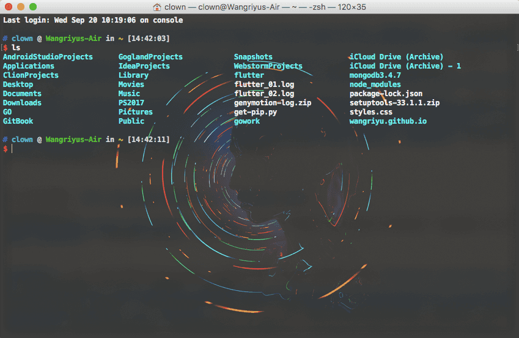
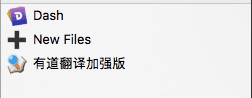

# Collections

整理自己的收藏

> 这些只是收录我现在用到的东西，没有特意收集的意思，未必很全，但每个应该都很实用

- [插件篇](#插件篇)
- [软件篇](#软件篇)
- [应用篇](#应用篇)
- [网站篇](#网站篇)
- [star篇](#star篇)

## 插件篇

### Chrome插件

- Adblock Plus:：屏蔽广告，必备，不用介绍
- [Code Cola](https://chrome.google.com/webstore/detail/code-cola/lomkpheldlbkkfiifcbfifipaofnmnkn "点击访问")：一个可视化编辑在线页面css样式的chrome插件，相当于控制台修改的效果，但方便很多
- [Full Page Screen Capture](https://chrome.google.com/webstore/detail/full-page-screen-capture/fdpohaocaechififmbbbbbknoalclacl "点击访问")：可以滚动截取整个网页
- Google Translate：谷歌翻译，点击翻译
- [Page Ruler](https://chrome.google.com/webstore/detail/page-ruler/jlpkojjdgbllmedoapgfodplfhcbnbpn "点击访问")：网页标尺，可以方便测量各个元素的尺寸
- [Web Developer](http://chrispederick.com/work/web-developer/ "点击访问")：前端必备，功能强大，可以设置网页上几乎所有东西
- [WEB前端助手(FeHelper)](https://chrome.google.com/webstore/detail/web%E5%89%8D%E7%AB%AF%E5%8A%A9%E6%89%8Bfehelper/pkgccpejnmalmdinmhkkfafefagiiiad?utm_source=chrome-ntp-icon "点击访问")：也是前端必备，包括json美化、页面测试、编解码、代码美化压缩等等
- 有道云笔记网页剪报：配合有道云笔记，方便收藏各种笔记、网页
- [Wide Github](https://chrome.google.com/webstore/detail/wide-github/kaalofacklcidaampbokdplbklpeldpj "点击访问")：加宽GitHub的页面内容，让你的GitHub网页显示更舒服
- [Sourcegraph for GitHub](https://chrome.google.com/webstore/detail/sourcegraph-for-github/dgjhfomjieaadpoljlnidmbgkdffpack "点击访问")：相当于一个IDE，直接查看GitHub上的仓库
- [Octotree](https://chrome.google.com/webstore/detail/octotree/bkhaagjahfmjljalopjnoealnfndnagc?hl=en-US "点击访问")：GitHub插件，极力推荐，在仓库左上角显示目录，直接点击文件跳转，不用一级级打开网页上的repo
- [Insight.io for Github](https://chrome.google.com/webstore/detail/insightio-for-github/pmhfgjjhhomfplgmbalncpcohgeijonh "点击访问")：功能和Octotree类似，比Octotree略微高级点
- [Isometric Contributions](https://chrome.google.com/webstore/detail/isometric-contributions/mjoedlfflcchnleknnceiplgaeoegien "点击访问")：装逼利器，让GitHub profile页的提交记录立体化，跟gitee的效果差不多
- [GitHub Plus](https://chrome.google.com/webstore/detail/github-plus/anlikcnbgdeidpacdbdljnabclhahhmd "点击访问")：极力推荐，显示仓库、文件大小，并提供单文件的下载
- [Lisen1](http://listen1.github.io/listen1 "点击访问")：很棒的一个音乐插件，还有客户端版本
- [Muzli](https://muz.li/ "点击访问")：集合了很多网站的最新更新，一站式阅读新闻和资讯，适合设计者和开发者

### Terminal插件

Terminal插件和vim插件没怎么试过.感兴趣的可以到这个网站看看：[Vim Awesome](https://vimawesome.com/)

这里有几个我用过的:

- [Oh My ZSH](http://ohmyz.sh/)：方便个性化配置你的zsh。

  加个ys主题，换个字体，再加个背景图片，逼格立马上升了:

  
- [VimGameCodeBreak](https://github.com/johngrib/vim-game-code-break "点击访问")：打开一个文本，开始一盘打方块游戏吧，注意需要vim8.0
- [gtop](https://github.com/aksakalli/gtop "点击访问")：在终端显示电脑cpu、内存、进程信息

## 软件篇

- [PDF Expert](https://pdfexpert.com/ "点击访问")：mac上最好用最强大的pdf软件，如果资金有限不想购买的客官可以看下[Xclient.info](http://xclient.info/s/pdf-expert-for-mac.html?_=f7d710b8833dbc76de5d7640956a0551 "点击访问")
- [Typora](https://typora.io/ "点击访问")：方便快速地编写MarkDown，界面简单，实用高效
- [NetWorker](https://itunes.apple.com/cn/app/networker-%E6%98%BE%E7%A4%BA%E7%BD%91%E7%BB%9C%E4%BF%A1%E6%81%AF/id1163602886?mt=12 "点击访问")：状态栏显示网速，简单美观
- [Sip](https://sipapp.io/ "点击访问")：很好用的取色工具，需要购买，如果资金有限不想购买的客官可以看下[Xclient.info](http://xclient.info/s/sip.html?_=f7d710b8833dbc76de5d7640956a0551 "点击访问")
- [FastStone Capture](http://faststone.org/FSCaptureDetail.htm "点击访问")：Windows上一款非常强大的集取色截屏录屏于一身的软件，而且支持滚动截屏，可惜mac上没有
- [有道云笔记](https://note.youdao.com/ "点击访问")：收藏编写笔记很方便，配合浏览器插件可以收藏网页，关注官方公众号还可以把微信文章也收藏进去，我的所有收藏和笔记都可以放进去，而且多端同步随时可以看，手机版还可以写markdown
- [Snip](http://snip.qq.com/ "点击访问")：之前找mac上支持滚动截屏的软件，但没找到很好的能代替Windows平台利器FastStone的，这个Snip勉强符合滚动截屏的要求，但不能截部分
- [Jietu](https://itunes.apple.com/cn/app/%E6%88%AA%E5%9B%BE-jietu-%E5%BF%AB%E9%80%9F%E6%A0%87%E6%B3%A8-%E4%BE%BF%E6%8D%B7%E5%88%86%E4%BA%AB%E7%9A%84%E6%88%AA%E5%B1%8F%E5%B7%A5%E5%85%B7/id1059334054?mt=12 "点击访问")：和snip一样同出于鹅厂，也有滚动截屏，功能多一点，但仍不能截部分，而且名字略low
- [MindNode](https://itunes.apple.com/app/id992076693?mt=12&ign-mpt=uo%3D4 "点击访问")：很漂亮的一款思维导图，如果资金有限不想购买的客官可以看下[Xclient.info](http://xclient.info/s/mind-node-pro.html?_=f7d710b8833dbc76de5d7640956a0551 "点击访问")
- [Expressions](https://itunes.apple.com/cn/app/expressions/id913158085?l=en&mt=12 "点击访问")：一款macOS平台的强大的正则表达式工具，测试正则表达式，多种主题，选中高亮等。如果资金有限不想购买的客官可以看下[Xclient.info](http://xclient.info/s/expressions.html?_=f7d710b8833dbc76de5d7640956a0551 "点击访问")
- [WebTorrent](https://webtorrent.io/desktop/ "点击访问")：直接看磁链里的内容，无需等待下载
- [Framer](https://framer.com/features/ "点击访问")：一个设计开发用的
- [Tumult](http://tumult.com/hype/pro/ "点击访问")：也是一个设计工具，还没用过
- [New File Menu](http://xclient.info/s/new-file-menu.html?_=8f2ea7453a409bd6674c05d22079f675 "点击访问")：finder扩展，右键新建文件，还可以自定义文件模板
- [Leaf](https://itunes.apple.com/cn/app/leaf-rss-news-reader/id576338668?l=en&mt=12)：RSS News Reader, 订阅RSS源后，可以一站式阅读，之前不知道rss这东西，傻傻地一个个打开别人博客看文章

  这里有一些收藏的RSS源: [CSDN博客推荐文章](http://blog.csdn.net/rss.html)、[阮一峰的网络日志](http://www.ruanyifeng.com/blog/atom.xml)、[小胡子哥](http://www.barretlee.com/rss2.xml)、
  [酷壳](https://coolshell.cn/feed)、[张鑫旭](http://www.zhangxinxu.com/wordpress/feed/)、[前端开发博客](http://caibaojian.com/feed)、[Harttle Land](http://harttle.com/feed.xml)、[InfoQ](http://www.infoq.com/cn/feed)、
  [Web技术研究所](https://www.web-tinker.com/rss.xml)、[三水清](http://js8.in/atom.xml)、[刘彦玮](http://liuyanwei.jumppo.com/pages/rss.xml)、[ChokCoco](http://feed.cnblogs.com/blog/u/177636/rss)、
  [小士刀](http://wdxtub.com/atom.xml)、[贾鹏辉](http://www.devio.org/feed.xml)、[颜海镜](http://yanhaijing.com/rss.xml)、[干货集中营](http://gank.io/feed)、[奇舞周刊](https://weekly.75team.com/rss.php)、[码农周刊](http://blog.manong.io/rss.xml)、[InfoQ](http://www.infoq.com/cn/feed)、[OneTwo](http://onetwo.ren//feed.xml)
- [智图](https://zhitu.isux.us/ "点击访问")：图片压缩，方便快捷
- [萤火虫Firefly](https://github.com/yinghuocho/firefly-proxy "点击访问")：一款翻墙软件，电脑手机都有
- [蓝灯](https://github.com/getlantern/lantern "点击访问")：蓝灯VPN，速度挺快的，如果下载发行版的话有流量限制，建议去GitHub上照步骤自己编译程序，这样是没有流量限制的
- [XX-Net](https://github.com/XX-net/XX-Net "点击访问")：很好用的翻墙工具，但配置会麻烦一点
- [Dash](https://kapeli.com/dash "点击访问")：开发者必备，各种API文档，配合Alfred查询非常方便，如果资金有限不想购买的客官可以看下[Xclient.info](http://xclient.info/s/dash.html?_=f7d710b8833dbc76de5d7640956a0551 "点击访问")
- [xScope](http://xscopeapp.com "点击访问")：设计开发辅助工具，有10个实用优秀的小工具，如屏幕镜像、屏幕标尺、放大镜、十字定位等等
- [ohMyStar2](https://itunes.apple.com/cn/app/ohmystar2-best-way-to-organize-your-github-stars/id1218642292?l=en&mt=12 "点击访问")：强烈推荐的一个软件，可以管理GitHub账号的star，分类管理添加标签，还可以看热门项目，对于star几百个的人太有用了
- [gitee](https://github.com/Nightonke/Gitee "点击访问")：显示GitHub账号信息，方便查看trending、项目信息等
- [Slack](https://slack.com/ "点击访问")：开发人员的聊天app，主要是国外用户，加入不同的channel，了解不同的地域风格，与国外友人交流
- [Gitter](http://gitter.im "点击访问")：也是一款开发人员地聊天app，集合各种语言和框架，与其相关的还有一个GitLab
- [Alfred](https://www.alfredapp.com/ "点击访问")：如果上面的都是神器，那这个就是超神器，我会详细介绍一下它的使用，强烈推荐。附上[使用教程](http://wellsnake.com/jekyll/update/2014/06/15/001/ "点击访问")。

  建议关掉mac自带的Spotlight, 将Alfred快捷键设置成cmd + space(原Spotlight快捷键)；

  把常用的网站，特别是搜索类的放到websearch里：

  

  把浏览器书签导入Safari，可以用Alfred搜索打开；快捷键打开终端；查询文档；搜索打开文件；记录Clipboard历史等等...

  当然最强大的功能还是workflow：

## 应用篇

本人手机安卓，所以只推荐一些自用的安卓应用

- [Google Play]：第一推荐当然是谷歌商店啦，上面也有很多精品应用
- [蓝灯VPN]：要访问谷歌肯定要翻墙，蓝灯还是能用的，之前用的是green，但后来又被封了
- [萤火虫VPN]：萤火虫也是可以用的
- [知乎、简书、轻氧、掘金、开发者头条]：学习的好地方
- [FastHub](https://play.google.com/store/apps/details?id=com.fastaccess.github)：FastHub for GitHub，集合了GitHub基本所需的所有功能
- [最美应用](http://zuimeia.com/apps/?platform=2 "点击访问")：这是一个应用的名字，是最美团队出品的，收集了很多精品应用
- [Flipboard](https://play.google.com/store/apps/details?id=flipboard.app&hl=zh_CN "点击访问")：需要翻墙，一些时事资讯。热门文章等
- [ZUI Days](https://play.google.com/store/apps/details?id=com.zuiapps.suite.days&hl=zh_CN "点击访问")：一款很漂亮的记录时间和重要纪念日的应用
- [即刻](https://play.google.com/store/apps/details?id=com.ruguoapp.jike&hl=zh_CN "点击访问")：专门为你定制的内容推送，推荐使用
- [Google Spotlight Stories](https://play.google.com/store/apps/details?id=com.google.android.spotlightstories&hl=zh_CN "点击访问")：用手机看真•3D视频，效果很棒，值得一试
- [Memorado](https://play.google.com/store/apps/details?id=com.memorado.brain.games&hl=zh_CN "点击访问")：很棒的一款脑力游戏，画面精美，无聊的时候练练脑力
- [PicsArt](https://play.google.com/store/apps/details?id=com.picsart.studio&hl=zh_CN "点击访问")：很强大的修图应用，但让我印象深刻的是里面的魔法：可以将一张图转换成其他图片的风格，比如梵高的星夜
- [Designer Tools](https://play.google.com/store/apps/details?id=com.scheffsblend.designertools&hl=zh_CN "点击访问")：设计师工具，提供了网格覆盖图、样机覆盖图、取色器、截图细节等
- [Curiosity](https://play.google.com/store/apps/details?id=com.curiosity.dailycuriosity&hl=zh_CN "点击访问")：各种视频，了解世界，增长见识
- [Via浏览器](https://play.google.com/store/apps/details?id=mark.via.gp&hl=zh_CN "点击访问")：非常小巧的浏览器，但功能一应俱全，而且响应速度很快，类似的还有一个夸克浏览器

## 网站篇

- [Xclient](http://xclient.info "点击访问")：精品mac应用分享
- [Devdocs](http://devdocs.io/ "点击访问")：API文档，功能和Dash差不多
- [印记中文](https://www.docschina.org/ "点击访问")：一些权威中文文档
- [HtmlPreview](https://htmlpreview.github.io/ "点击访问")：HTML链接预览，可以用于预览github上的html文件
- [在线压缩视频ClipChamp](https://clipchamp.com/zh-Hans/dashboard "点击访问")：方便好用
- [视频转换器](https://ezgif.com/video-to-gif "点击访问")：视频转GIF，压缩、裁剪等等
- [百度脑图](http://naotu.baidu.com/home "点击访问")：在线创建思维导图，功能强大
- [前端开发博客](http://caibaojian.com/page/3 "点击访问")：前端优质内容
- [干货集中营](http://gank.io/ "点击访问")：确实有干货，还有妹纸
- [tutorialzine](https://tutorialzine.com/articles "点击访问")：前端文章推送
- [Collect UI ](http://collectui.com/ "点击访问")：UI设计灵感
- [优设](http://www.uisdc.com/75-web-animation-tools-1# "点击访问")：关于设计和开发
- [CodePen](https://codepen.io/picks/2/ "点击访问")：各种有趣的js demo和项目
- [Codrops](https://tympanus.net/codrops/category/playground/ "点击访问")：各种优质文章和设计
- [CTOLib码库](https://www.ctolib.com/ "点击访问")：各种代码库
- [网易代码库](http://nec.netease.com/library "点击访问")
- [Dribbble](https://dribbble.com/ "点击访问")：优秀设计模板
- [Behance](https://www.behance.net/ "点击访问")：优秀设计创意作品
- [压缩图片](https://tinypng.com/ "点击访问")
- [在线画图Asciiflow](http://asciiflow.com/ "点击访问")
- [TheCodePlayer](http://thecodeplayer.com/ "点击访问")：很棒的HTML5、CSS3、JS学习网站，代码一行一行视频演示
- [Freshdesignweb](https://www.freshdesignweb.com/ "点击访问")：网站设计
- [CSS-Tricks](https://css-tricks.com/ "点击访问")：学习CSS不可错过此网站
- [JSRUN](http://en.jsrun.net/ "点击访问")：类似codepen，提供在线编写代码，也有很多有趣demo
- [CssDeck](http://cssdeck.com/ "点击访问")：一些展示CSS效果的demo
- [在线工具汇总](http://tool.oschina.net/ "点击访问")
- [觉唯设计](http://www.jiawin.com/10-design-artifact "点击访问")
- [SmashingMagazine](https://www.smashingmagazine.com/tag/javascript/ "点击访问")：前端杂志
- [NavNav](http://navnav.co/ "点击访问")：各种响应式菜单的设计
- [CODYHOUSE](https://codyhouse.co/library/ "点击访问")：视觉设计
- [CSS Wizardry Posts Archive](https://csswizardry.com/archive/ "点击访问")：优质博客文章，很多关于css和设计的
- [textify.it](http://textify.it/ "点击访问")：一个有趣的网站，可以把图片字符化
- [DeveloperDrive](http://www.developerdrive.com/categories/ "点击访问")：提供大量优质文章
- [HACKNOON](https://hackernoon.com/ "点击访问")：极客的下午茶时间，推送很多优质文章
- [假装 Windows 升级界面](http://fakeupdate.net/ "点击访问")
- [SeeSeed](https://www.seeseed.com/ "点击访问")：设计与灵感，适合设计师用
- [百度•图说](http://tushuo.baidu.com/wave/index#/gallery "点击访问")：在线创建图表
- [Echart](http://gallery.echartsjs.com/explore.html#sort=rank~timeframe=all~author=all "点击访问")：漂亮又强大的图表库
- [CSSWinner](http://www.csswinner.com/blog/)：CSS Award Gallery for Website Design Inspiration
- [众成翻译](http://www.zcfy.cc/translate/discovery)：有很多翻译的和未翻译的文章，值得翻一翻看一看
- [果壳-科学人](http://www.guokr.com/scientific/)：挺多有趣的科学文章
- [Airbnb](https://zh.airbnb.com/)
- [Medium](https://medium.com/)：各种文章
- [Google PageSpeed Tools](https://developers.google.com/speed/pagespeed/?hl=zh-CN&utm_source=PSI&utm_medium=incoming-link&utm_campaign=PSI)：谷歌站点分析，网站速度性能评分
- [ARKie](http://www.arkie.cn/)：自动帮你设计海报，很好用
- [IconFont](http://iconfont.cn/)：阿里巴巴矢量图标库
- [PPT遥控器](http://ppt.baidu.com/)：用手机当ppt遥控器
- [Wordart](https://wordart.com/)：在线生成文字云
- [在线生成短链](https://goo.gl/#)：谷歌在线生成短链工具
- [Gfycat](https://gfycat.com/)：各种动图
- [Mockups](https://mockupsjar.com/)：三步生成逼真的网站、手机的设计稿
- [ColorSpace](https://mycolor.space/gradient)：生成渐进色背景
- [frontend.directory](https://frontend.directory/p)：罗列了各种前端的资源
- [前端面试题](http://hawx1993.github.io/Front-end-Interview-Questions/#/?id=interview-quesetions)：长期更新的，内容挺全
- [FKS](http://html5ify.com/fks/)：Frontend Knowledge Structure，前端知识体系汇总
- [CSS3PIE](http://css3pie.com/)：PIE使IE6~9可以支持大部分CSS3的样式
- [img2css](https://javier.xyz/img2css/)：将图片转成css，适合一些小图标，大图就不要尝试了
- [Trello](https://trello.com/#)：看板，GitHub上有一个类似的项目叫[wekan](https://wekan.indie.host/)
- [BootCDN](http://www.bootcdn.cn/)：找一些库的cdn很方便
- [云真机](http://wetest.qq.com/product/cloudphone)：腾讯推出的服务，可以线上测试各种手机
- [码农头条](http://hao.caibaojian.com/)
- [码农周刊](http://weekly.manong.io/issues/)
- [CSS Animate](http://cssanimate.com/)：在线生成css动画

## star篇

> 下面这些是star的项目，用[starred](https://github.com/maguowei/starred)工具生成的
> > A curated list of my GitHub stars!  Generated by [starred](https://github.com/maguowei/starred)

## Contents

  - [C](#c)
  - [C#](#c#)
  - [C++](#c++)
  - [CSS](#css)
  - [CoffeeScript](#coffeescript)
  - [Dart](#dart)
  - [Go](#go)
  - [HTML](#html)
  - [Java](#java)
  - [JavaScript](#javascript)
  - [Kotlin](#kotlin)
  - [Objective-C](#objective-c)
  - [Others](#others)
  - [PHP](#php)
  - [Python](#python)
  - [Ruby](#ruby)
  - [Shell](#shell)
  - [Smarty](#smarty)
  - [Swift](#swift)
  - [TypeScript](#typescript)
  - [Vim script](#vimscript)
  - [Vue](#vue)

## C 

- [CSAPP](https://github.com/vonzhou/CSAPP) - CSAPP,《深入理解计算机系统结构》2nd ，阅读与实践！

## C# # 

- [NiceHashMiner](https://github.com/nicehash/NiceHashMiner) - NiceHash easy to use CPU&GPU Miner

## C++ 

- [brpc](https://github.com/brpc/brpc) - Most common RPC framework used throughout Baidu, with 600,000+ instances and 500+ kinds of services, called "baidu-rpc" inside Baidu.
- [butteraugli](https://github.com/google/butteraugli) - butteraugli estimates the psychovisual difference between two images
- [tensorflow](https://github.com/tensorflow/tensorflow) - Computation using data flow graphs for scalable machine learning
- [NuoModelViewer](https://github.com/middlefeng/NuoModelViewer) - A simple Wavefront OBJ viewer.
- [electron](https://github.com/electron/electron) - Build cross platform desktop apps with JavaScript, HTML, and CSS
- [rainmeter](https://github.com/rainmeter/rainmeter) - Desktop customization tool for Windows

## CSS 

- [zepto.fullpage](https://github.com/yanhaijing/zepto.fullpage) - 专注于移动端的fullPage.js
- [primer-css](https://github.com/primer/primer-css) - The CSS framework that powers GitHub's front-end design.
- [devices.css](https://github.com/picturepan2/devices.css) - Modern devices in pure CSS
- [bounce.js](https://github.com/tictail/bounce.js) - Create beautiful CSS3 powered animations in no time.
- [magic](https://github.com/miniMAC/magic) - CSS3 Animations with special effects
- [hexo-theme-yelee](https://github.com/MOxFIVE/hexo-theme-yelee) - 简而不减 Hexo 双栏博客主题; Another simple and elegant theme for Hexo.
- [animate.css](https://github.com/daneden/animate.css) - 🍿 A cross-browser library of CSS animations. As easy to use as an easy thing.
- [hexo-theme-ambition](https://github.com/vankai/hexo-theme-ambition) - Yellow & black color style. Clean. Pure reading experience.

## CoffeeScript 

- [dynamics.js](https://github.com/michaelvillar/dynamics.js) - Javascript library to create physics-based animations

## Dart 

- [flutter](https://github.com/flutter/flutter) - Flutter makes it easy and fast to build beautiful mobile apps.

## Go 

- [beego](https://github.com/astaxie/beego) - beego is an open-source, high-performance web framework for the Go programming language.
- [kubernetes](https://github.com/kubernetes/kubernetes) - Production-Grade Container Scheduling and Management
- [draft](https://github.com/Azure/draft) - A tool for developers to create cloud-native applications on Kubernetes.
- [gosnippet](https://github.com/TechCatsLab/gosnippet) - Go 深入学习
- [lantern](https://github.com/getlantern/lantern) - 🔴Lantern Latest Download https://github.com/getlantern/lantern/releases/tag/latest 🔴蓝灯最新版本下载 https://github.com/getlantern/forum/issues/833 🔴
- [blockchain_go](https://github.com/Jeiwan/blockchain_go) - A simplified blockchain implementation in Golang
- [awesome-go](https://github.com/avelino/awesome-go) - A curated list of awesome Go frameworks, libraries and software
- [ERP](https://github.com/hexiaoyun128/ERP) - 基于beego的进销存系统
- [firefly-proxy](https://github.com/yinghuocho/firefly-proxy) - A proxy software to help circumventing the Great Firewall.
- [kubeless](https://github.com/kubeless/kubeless) - Kubernetes Native Serverless Framework
- [google-api-go-client](https://github.com/sunanxiang/google-api-go-client) - Auto-generated Google APIs for Go
- [MD5-decode-violently](https://github.com/sunanxiang/MD5-decode-violently) - decode MD5 with a violent way
- [baidu-ai-go-sdk](https://github.com/chenqinghe/baidu-ai-go-sdk) - 百度AI服务go语言sdk
- [golangdoc.translations](https://github.com/golang-china/golangdoc.translations) - Go语言文档翻译文件
- [go-fundamental-programming](https://github.com/Unknwon/go-fundamental-programming) - 《Go 编程基础》是一套针对 Google 出品的 Go 语言的视频语音教程，主要面向新手级别的学习者。
- [build-web-application-with-golang](https://github.com/astaxie/build-web-application-with-golang) - A golang ebook intro how to build a web with golang
- [kotlin-in-chinese](https://github.com/huanglizhuo/kotlin-in-chinese) - kotlin 官方文档翻译

## HTML 

- [cockroachdb_docs_cn](https://github.com/TechCatsLab/cockroachdb_docs_cn) - CockroachDB 文档中文翻译
- [node-interview](https://github.com/ElemeFE/node-interview) - How to pass the Node.js interview of ElemeFE.
- [Font-Awesome](https://github.com/FortAwesome/Font-Awesome) - The iconic font and CSS toolkit
- [angular-material-dashboard](https://github.com/wangdicoder/angular-material-dashboard) - a material-design dashboard by using angular
- [marked](https://github.com/chjj/marked) - A markdown parser and compiler. Built for speed.

## Java 

- [zstack](https://github.com/zstackio/zstack) - ZStack - the open-source IaaS software http://zstack.org (国内用户请至 http://zstack.io)
- [BoomMenu](https://github.com/Nightonke/BoomMenu) - A menu which can ... BOOM! - Android
- [CoCoin](https://github.com/Nightonke/CoCoin) - CoCoin, Multi-view Accounting Application
- [interviews](https://github.com/kdn251/interviews) - Everything you need to know to get the job.
- [VirtualAPK](https://github.com/didi/VirtualAPK) - A powerful and lightweight plugin framework for Android
- [SmartRefreshLayout](https://github.com/scwang90/SmartRefreshLayout) - 下拉刷新、上拉加载、RefreshLayout、OverScroll，Android智能下拉刷新框架，支持越界回弹，具有极强的扩展性，集成了几十种炫酷的Header和 Footer。
- [BilibiliSearchView](https://github.com/didixyy/BilibiliSearchView) - 
- [KotlinMix](https://github.com/donnfelker/KotlinMix) - Example code for the Kotlin and Anko Article
- [from-java-to-kotlin](https://github.com/MindorksOpenSource/from-java-to-kotlin) - From Java To Kotlin - Your Cheat Sheet For Java To Kotlin
- [kotlin](https://github.com/JetBrains/kotlin) - The Kotlin Programming Language
- [BGABadgeView-Android](https://github.com/bingoogolapple/BGABadgeView-Android) - Android 徽章控件
- [CNode-Material-Design](https://github.com/TakWolf/CNode-Material-Design) - CNode 社区第三方 Android 客户端，原生 App，Material Design 风格，支持夜间模式。
- [WeGit](https://github.com/Leaking/WeGit) - An Android App for Github
- [EverMemo](https://github.com/daimajia/EverMemo) - Fast Record,Organize,and Share. The android memo app you will deeply love. ❤
- [wechat](https://github.com/motianhuo/wechat) - A High Copy WeChat ,SNS APP (高仿微信)
- [Material-Movies](https://github.com/saulmm/Material-Movies) - [Deprecated] An application about movies with material design
- [AisenWeiBo](https://github.com/wangdan/AisenWeiBo) - 新浪微博第三方Android客户端
- [SimplifyReader](https://github.com/chentao0707/SimplifyReader) - 一款基于Google Material Design设计开发的Android客户端，包括新闻简读，图片浏览，视频爽看 ，音乐轻听以及二维码扫描五个子模块。项目采取的是MVP架构开发，由于还是摸索阶段，可能不是很规范。但基本上应该是这么个套路，至少我个人认为是这样的~恩，就是这样的！
- [Talon-for-Twitter](https://github.com/klinker24/Talon-for-Twitter) - 100% open source version of my popular Talon for Twitter app on Android.
- [JamsMusicPlayer](https://github.com/psaravan/JamsMusicPlayer) - A free, powerful and elegant music player for Android.
- [muzei](https://github.com/romannurik/muzei) - Muzei Live Wallpaper for Android
- [OpenFlappyBird](https://github.com/deano2390/OpenFlappyBird) - An open source clone of a famous flappy bird game for Android using AndEngine
- [2048-android](https://github.com/uberspot/2048-android) - The android port of the 2048 game (for offline playing)
- [ZhuanLan](https://github.com/bxbxbai/ZhuanLan) - 非官方知乎专栏 - Android
- [ZhihuPaper](https://github.com/cundong/ZhihuPaper) - Zhihu Daily Android App
- [android-UniversalMusicPlayer](https://github.com/googlesamples/android-UniversalMusicPlayer) - This sample shows how to implement an audio media app that works across multiple form factors and provide a consistent user experience on Android phones, tablets, Auto, Wear and Cast devices
- [FastAccess](https://github.com/k0shk0sh/FastAccess) - A tiny launcher or as Samsung likes to call it Floating Toolbox.
- [Timber](https://github.com/naman14/Timber) - Material Design Music Player
- [githot](https://github.com/andyiac/githot) - GitHot is an Android App that will help you to find the world most popular project  and person
- [Euclid](https://github.com/Yalantis/Euclid) - User Profile Interface Animation
- [FlipViewPager.Draco](https://github.com/Yalantis/FlipViewPager.Draco) - This project aims to provide a working page flip implementation for usage in ListView.
- [Taurus](https://github.com/Yalantis/Taurus) - A little more fun for the pull-to-refresh interaction.
- [Phoenix](https://github.com/Yalantis/Phoenix) - Phoenix Pull-to-Refresh
- [Side-Menu.Android](https://github.com/Yalantis/Side-Menu.Android) - Side menu with some categories to choose.
- [Context-Menu.Android](https://github.com/Yalantis/Context-Menu.Android) - You can easily add awesome animated context menu to your app.
- [AndroidGeek](https://github.com/CodeXiaoMai/AndroidGeek) - "Android Geek（Android极客）"一个专门为Android程序猿打造的极客应用。主要包括： 干货笔记、GitHub Trending、密码管理 .......
- [Fragmentation](https://github.com/YoKeyword/Fragmentation) - A powerful library that manage Fragment for Android!
- [netease](https://github.com/lizhangqu/netease) - 高仿网易新闻客户端主界面，使用DrawerLayout+ToolBar实现双向侧滑
- [LoadingDrawable](https://github.com/dinuscxj/LoadingDrawable) - Some beautiful android loading drawable, can be combined with any view as the LoadingView or the ProgressBar. Besides, some Drawable can customize the loading progress too.
- [ExplosionField](https://github.com/tyrantgit/ExplosionField) - explosive dust effect for views
- [sealtalk-android](https://github.com/sealtalk/sealtalk-android) - Android App of SealTalk powered by RongCloud. 基于融云开发的 Android 版即时通讯（IM）应用程序 - 嗨豹。
- [lottie-android](https://github.com/airbnb/lottie-android) - Render After Effects animations natively on Android and iOS

## JavaScript 

- [backbone](https://github.com/jashkenas/backbone) - Give your JS App some Backbone with Models, Views, Collections, and Events
- [underscore](https://github.com/jashkenas/underscore) - JavaScript's utility _ belt
- [todomvc](https://github.com/tastejs/todomvc) - Helping you select an MV* framework - Todo apps for React.js, Ember.js, Angular, and many more
- [Swiper](https://github.com/nolimits4web/Swiper) - Most modern mobile touch slider with hardware accelerated transitions
- [webuploader](https://github.com/fex-team/webuploader) - It's a new file uploader solution!
- [impress.js](https://github.com/impress/impress.js) - It's a presentation framework based on the power of CSS3 transforms and transitions in modern browsers and inspired by the idea behind prezi.com.
- [reveal.js](https://github.com/hakimel/reveal.js) - The HTML Presentation Framework
- [onepage-scroll](https://github.com/peachananr/onepage-scroll) - Create an Apple-like one page scroller website (iPhone 5S website) with One Page Scroll plugin
- [slick](https://github.com/kenwheeler/slick) - the last carousel you'll ever need
- [fullPage.js](https://github.com/alvarotrigo/fullPage.js) - fullPage plugin by Alvaro Trigo. Create full screen pages fast and simple
- [parallax](https://github.com/wagerfield/parallax) - Parallax Engine that reacts to the orientation of a smart device
- [TweenJS](https://github.com/CreateJS/TweenJS) - A simple but powerful tweening / animation library for Javascript. Part of the CreateJS suite of libraries.
- [c3](https://github.com/c3js/c3) - A D3-based reusable chart library
- [sketch.js](https://github.com/soulwire/sketch.js) - Cross-Platform JavaScript Creative Coding Framework
- [Chart.js](https://github.com/chartjs/Chart.js) - Simple HTML5 Charts using the &lt;canvas&gt; tag
- [img2css](https://github.com/javierbyte/img2css) - Convert any image to pure CSS.
- [fks](https://github.com/JacksonTian/fks) - 前端技能汇总 Frontend Knowledge Structure
- [front-end-collect](https://github.com/foru17/front-end-collect) - 分享自己长期关注的前端开发相关的优秀网站、博客、以及活跃开发者
- [AlgorithmVisualizer](https://github.com/parkjs814/AlgorithmVisualizer) - Algorithm Visualizer
- [redocx](https://github.com/nitin42/redocx) - 📄  Create word documents with React
- [sentineljs](https://github.com/muicss/sentineljs) - Detect new DOM nodes using CSS selectors (682 bytes)
- [vuetify](https://github.com/vuetifyjs/vuetify) - Material Component Framework for Vue.js 2
- [blog](https://github.com/slashhuang/blog) - Front-end  tech thoughts and share-ppt
- [es6tutorial](https://github.com/ruanyf/es6tutorial) - 《ECMAScript 6入门》是一本开源的 JavaScript 语言教程，全面介绍 ECMAScript 6 新增的语法特性。
- [pixi.js](https://github.com/pixijs/pixi.js) - The HTML5 Creation Engine: Create beautiful digital content with the fastest, most flexible 2D WebGL renderer.
- [hexo](https://github.com/hexojs/hexo) - A fast, simple & powerful blog framework, powered by Node.js.
- [anime](https://github.com/juliangarnier/anime) - JavaScript Animation Engine
- [jsPDF](https://github.com/MrRio/jsPDF) - Client-side JavaScript PDF generation for everyone.
- [GayHub](https://github.com/jawil/GayHub) - An awesome chrome extension for github :octocat:
- [egg](https://github.com/wangduoxiong/egg) - 一个通用的爬虫
- [hyperapp](https://github.com/hyperapp/hyperapp) - 1 KB JavaScript library for building frontend applications.
- [better-scroll](https://github.com/ustbhuangyi/better-scroll) - inspired by iscroll, and it has a better scroll perfermance
- [nanoid](https://github.com/ai/nanoid) - A tiny (179 bytes), secure URL-friendly unique string ID generator for JavaScript
- [lozad.js](https://github.com/ApoorvSaxena/lozad.js) - 🔥  Highly performant, light ~0.5kb and configurable lazy loader in pure JS with no dependencies for responsive images, iframes and more
- [gtop](https://github.com/aksakalli/gtop) - System monitoring dashboard for terminal
- [gka](https://github.com/gkajs/gka) - 一款高效、高性能的帧动画生成工具
- [react-fontawesome](https://github.com/danawoodman/react-fontawesome) - A React Font Awesome component.
- [easy-mock](https://github.com/easy-mock/easy-mock) - A persistent service that generates mock data quickly and provids visualization view.
- [AlloyImage](https://github.com/AlloyTeam/AlloyImage) - 基于HTML5的专业级图像处理开源引擎。An image processing lib based on html5.
- [omi](https://github.com/AlloyTeam/omi) - Open and Modern framework for building user Interfaces - 开放现代的Web组件化框架
- [free-programming-books-zh_CN](https://github.com/justjavac/free-programming-books-zh_CN) - :books: 免费的计算机编程类中文书籍，欢迎投稿
- [react-native-lunar-calendar](https://github.com/Txiaozhe/react-native-lunar-calendar) - A react-native lunar calendar project for android and ios.
- [echarts-for-react](https://github.com/hustcc/echarts-for-react) - :chart_with_upwards_trend: baidu Echarts(v3.0) components for React wrapper. 一个简单的 echarts(v3.0) 的 react 封装。
- [echarts-liquidfill](https://github.com/ecomfe/echarts-liquidfill) - ECharts Liquid Fill Chart
- [react-markdown](https://github.com/rexxars/react-markdown) - Render Markdown as React components
- [markdown-here](https://github.com/adam-p/markdown-here) - Google Chrome, Firefox, and Thunderbird extension that lets you write email in Markdown and render it before sending.
- [react-lz-editor](https://github.com/leejaen/react-lz-editor) - A best react text editor component ( mordern react text editor includes media support such as texts, images, videos, audios, links etc. ), development based on Draft-Js and Ant-design, good support html, markdown, draft-raw mode.      一款基于 draft-Js 和 ant-design 实现的 react 富文本编辑器组件，支持文本、图片、视频、音频、链接等元素插入，同时支持HTML、markdown、draft Raw格式。
- [Hommily-Editor](https://github.com/suyulin/Hommily-Editor) - React rich text editor built using Draft.js
- [react-markdown](https://github.com/leozdgao/react-markdown) - text editor for markdown in react (不再维护)
- [markdown-js](https://github.com/evilstreak/markdown-js) - A Markdown parser for javascript
- [react-markdown-editor](https://github.com/LingyuCoder/react-markdown-editor) - React Markdown 编辑器，自带存储到localstorage
- [echarts](https://github.com/ecomfe/echarts) - A powerful, interactive charting and visualization library for browser
- [curvejs](https://github.com/AlloyTeam/curvejs) - Made curve a dancer in HTML5 canvas - 魔幻线条
- [aiexperiments-ai-duet](https://github.com/googlecreativelab/aiexperiments-ai-duet) - A piano that responds to you.
- [iSlider](https://github.com/be-fe/iSlider) - Smooth mobile touch slider for Mobile WebApp, HTML5 App, Hybrid App
- [nodeppt](https://github.com/ksky521/nodeppt) - This is probably the best web presentation tool so far!
- [react-bootstrap](https://github.com/react-bootstrap/react-bootstrap) - Bootstrap 3 components built with React
- [pell](https://github.com/jaredreich/pell) - 📝 the simplest and smallest (1kB) WYSIWYG text editor for web, with no dependencies
- [titanic](https://github.com/icons8/titanic) - A set of animated icons + code to insert them into the webpages
- [win10-ui](https://github.com/yuri2peter/win10-ui) - Win10风格的UI框架。Windows10 style UI framework.
- [RNWeChat](https://github.com/yubo725/RNWeChat) - 使用ReactNative开发的仿微信客户端
- [FeHelper](https://github.com/zxlie/FeHelper) - Web前端助手--FeHelper（Chrome扩展）
- [MyUtil](https://github.com/jawil/MyUtil) - 早期入门学习中记录和整理一些实用的笔记🎯
- [algorithm](https://github.com/jawil/algorithm) - JS常用的数据结构和算法,链表、栈、队列、排序和查找:octocat:
- [egg-react-webpack-boilerplate](https://github.com/hubcarl/egg-react-webpack-boilerplate) - 基于Egg + React + Webpack3/Webpack2 多页面和单页面服务器渲染同构工程骨架项目
- [node](https://github.com/nodejs/node) - Node.js JavaScript runtime :sparkles::turtle::rocket::sparkles:
- [react-beautiful-dnd](https://github.com/atlassian/react-beautiful-dnd) - Beautiful, accessible drag and drop for lists with React.js
- [d3](https://github.com/d3/d3) - Bring data to life with SVG, Canvas and HTML. :bar_chart::chart_with_upwards_trend::tada:
- [KaTeX](https://github.com/Khan/KaTeX) - Fast math typesetting for the web.
- [meteor](https://github.com/meteor/meteor) - Meteor, the JavaScript App Platform
- [egg](https://github.com/eggjs/egg) - Born to build better enterprise frameworks and apps with Node.js & Koa
- [iantd](https://github.com/TechCatsLab/iantd) - 以 ant-design 为 UI 框架制作的一款管理后台模板，集成了 Markdown编辑、数据统计、反馈、列表展示、多语言支持、一键换肤等功能。
- [wtfjs](https://github.com/denysdovhan/wtfjs) - A list of funny and tricky JavaScript examples
- [daily-algorithms](https://github.com/barretlee/daily-algorithms) - 算法，每日练习
- [Mock](https://github.com/nuysoft/Mock) - A simulation data generator
- [vue](https://github.com/vuejs/vue) - A progressive, incrementally-adoptable JavaScript framework for building UI on the web.
- [recharts](https://github.com/recharts/recharts) - Redefined chart library built with React and D3
- [Semantic-UI-React](https://github.com/Semantic-Org/Semantic-UI-React) - The official Semantic-UI-React integration
- [Semantic-UI](https://github.com/Semantic-Org/Semantic-UI) - Semantic is a UI component framework based around useful principles from natural language.
- [react-antd-admin](https://github.com/jiangxy/react-antd-admin) - 用React和Ant Design搭建的一个通用管理后台
- [draft-js](https://github.com/facebook/draft-js) - A React framework for building text editors.
- [react-animations](https://github.com/FormidableLabs/react-animations) - A collection of animations for inline style libraries
- [react-motion](https://github.com/chenglou/react-motion) - A spring that solves your animation problems.
- [ant-motion](https://github.com/ant-design/ant-motion) - :bicyclist: Animate specification and components of Ant Design
- [amazeui](https://github.com/amazeui/amazeui) - Amaze UI, a mobile-first and modular front-end framework.
- [rxdb](https://github.com/pubkey/rxdb) - :computer: :iphone: A reactive Database for Progressive Web Apps and more
- [iscroll](https://github.com/cubiq/iscroll) - Smooth scrolling for the web
- [classnames](https://github.com/JedWatson/classnames) - A simple javascript utility for conditionally joining classNames together
- [fiora](https://github.com/yinxin630/fiora) - An interesting chat application power by koa, react and react-native.
- [react-redux-chat](https://github.com/meibin08/react-redux-chat) - react+redux-chat 模仿实现PC微信聊天
- [zui](https://github.com/easysoft/zui) - ZUI is an HTML5 front UI framework.
- [react-native-scrollable-tab-view](https://github.com/skv-headless/react-native-scrollable-tab-view) - Tabbed navigation that you can swipe between, each tab can have  its own ScrollView and maintain its own scroll position between swipes. Pleasantly animated. Customizable tab bar
- [30-days-of-react-native](https://github.com/fangwei716/30-days-of-react-native) - 30 days of React Native demos
- [react-native-ui-kitten](https://github.com/akveo/react-native-ui-kitten) - 🐱  Customizable and reusable react-native component kit
- [matter-js](https://github.com/liabru/matter-js) - a 2D rigid body physics engine for the web ▲● ■
- [preact](https://github.com/developit/preact) - ⚛️ Fast 3kb React alternative with the same ES6 API. Components & Virtual DOM.
- [material-ui](https://github.com/callemall/material-ui) - React Components that Implement Google's Material Design.
- [listen1_chrome_extension](https://github.com/listen1/listen1_chrome_extension) - one for all free music in china (chrome extension, also works for firefox)
- [g2-react](https://github.com/antvis/g2-react) - ⛵️ Factory wrapper for using G2 easily in a React Component
- [tree2](https://github.com/yujintang/tree2) - 
- [react-native](https://github.com/facebook/react-native) - A framework for building native apps with React.
- [node-elm](https://github.com/bailicangdu/node-elm) - 基于 node.js + Mongodb 构建的后台系统
- [react-antd-admin](https://github.com/fireyy/react-antd-admin) - React Ant.design Admin UI
- [redux-saga](https://github.com/redux-saga/redux-saga) - An alternative side effect model for Redux apps
- [react-native-smart-badge](https://github.com/react-native-component/react-native-smart-badge) - A smart badge for react-native apps
- [animation-demo](https://github.com/bamlab/animation-demo) - react native animation demo
- [react-native-progress](https://github.com/oblador/react-native-progress) - Progress indicators and spinners for React Native using ReactART
- [antd-admin](https://github.com/zuiidea/antd-admin) - A admin dashboard application demo built upon Ant Design and Dva.js
- [dva](https://github.com/dvajs/dva) - 🌱 React and redux based, lightweight and elm-style framework. (Inspired by elm and choo)
- [showdown](https://github.com/showdownjs/showdown) - A Markdown to HTML converter written in Javascript
- [react-native-pullable-view](https://github.com/xotahal/react-native-pullable-view) - 
- [react-native-lightbox](https://github.com/oblador/react-native-lightbox) - Images etc in Full Screen Lightbox Popovers for React Native
- [react-native-parallax](https://github.com/oblador/react-native-parallax) - Parallax effects for React Native using Animated API
- [react-native-gifted-chat](https://github.com/FaridSafi/react-native-gifted-chat) - 💬 The most complete chat UI for React Native
- [react-native-animated-ptr](https://github.com/evetstech/react-native-animated-ptr) - an easy-to-create custom animated pull to refresh component
- [react-native-pan-drawer](https://github.com/yjy5264/react-native-pan-drawer) - A cross-platform (iOS&Android), drawer component for React Native.
- [react-native-card-carousel](https://github.com/yjy5264/react-native-card-carousel) - infinite card style carousel for react-native project
- [mdui](https://github.com/zdhxiong/mdui) - MDUI 是一个基于 Material Design 的前端框架。
- [react-native-swiper](https://github.com/leecade/react-native-swiper) - The best Swiper component for React Native.
- [Shop-React-Native](https://github.com/EleTeam/Shop-React-Native) - EleTeam开源项目 - 电商全套解决方案之 React Native 版 - Shop-React-Native。一个类似京东/天猫/淘宝的商城，有对应的服务端支持，由EleTeam团队维护！
- [react-native-zhihu-app](https://github.com/LeezQ/react-native-zhihu-app) - 用 react native 做的知乎专栏 app
- [react-native-buyscreen](https://github.com/appintheair/react-native-buyscreen) - Simple promo buy-screen to display in-app products for purchase
- [react-native-htmlview](https://github.com/jsdf/react-native-htmlview) - A React Native component which renders HTML content as native views
- [react-native-swipeout](https://github.com/dancormier/react-native-swipeout) - iOS-style swipeout buttons behind component
- [lottie-react-native](https://github.com/airbnb/lottie-react-native) - Lottie wrapper for React Native.
- [react-navigation](https://github.com/react-community/react-navigation) - Learn once, navigate anywhere
- [blog](https://github.com/dwqs/blog) - :dog: :clap: :star2: Blog's Address. Welcome to star
- [ReactNative_Shopping](https://github.com/JasonStu/ReactNative_Shopping) - 电商类Reac Native App
- [JueJinClient](https://github.com/wangdicoder/JueJinClient) - a react-native app simulating JueJin App running on both Android and iOS
- [react-native-datepicker](https://github.com/xgfe/react-native-datepicker) - react native datePicker component for both Android and IOS, useing DatePikcerAndroid, TimePickerAndroid and DatePickerIOS
- [NativeBase](https://github.com/GeekyAnts/NativeBase) - Essential cross-platform UI components for React Native
- [redux](https://github.com/reactjs/redux) - Predictable state container for JavaScript apps
- [three.js](https://github.com/mrdoob/three.js) - JavaScript 3D library.
- [javascript](https://github.com/airbnb/javascript) - JavaScript Style Guide
- [react](https://github.com/facebook/react) - A declarative, efficient, and flexible JavaScript library for building user interfaces.
- [bootstrap](https://github.com/twbs/bootstrap) - The most popular HTML, CSS, and JavaScript framework for developing responsive, mobile first projects on the web.
- [react-native-action-button](https://github.com/mastermoo/react-native-action-button) - customizable multi-action-button component for react-native

## Kotlin 

- [kotlin-notes](https://github.com/mcxiaoke/kotlin-notes) - Kotlin Notes
- [PoiShuhui-Kotlin](https://github.com/wuapnjie/PoiShuhui-Kotlin) - 一个用Kotlin写的简单漫画APP
- [awesome-kotlin](https://github.com/KotlinBy/awesome-kotlin) - A curated list of awesome Kotlin related stuff Inspired by awesome-java.
- [anko](https://github.com/Kotlin/anko) - Pleasant Android application development
- [android-topeka](https://github.com/googlesamples/android-topeka) - A fun to play quiz that showcases material design on Android

## Objective-C 

- [CRNumberFadedAnimation](https://github.com/CRAnimation/CRNumberFadedAnimation) - CRNumberFaded
- [FoldingTabBar.iOS](https://github.com/Yalantis/FoldingTabBar.iOS) - Folding Tab Bar and Tab Bar Controller
- [react-native-native-module](https://github.com/Xing-He/react-native-native-module) - react-native 调用ios / android (Toast) 原生模块 学习笔记
- [RNStudyNotes](https://github.com/crazycodeboy/RNStudyNotes) - React Native 研究与实践

## Others 

- [awesome-javascript](https://github.com/sorrycc/awesome-javascript) - 🐢 A collection of awesome browser-side  JavaScript libraries, resources and shiny things.
- [frontend-dev-bookmarks](https://github.com/dypsilon/frontend-dev-bookmarks) - Manually curated collection of resources for frontend web developers.
- [tech-community-slacks](https://github.com/ladyleet/tech-community-slacks) - Here is a list of all the tech community slacks!
- [fullstack-webdev-path](https://github.com/shovanch/fullstack-webdev-path) - 📚 A learning path for Full-stack web development
- [every-programmer-should-know](https://github.com/mr-mig/every-programmer-should-know) - A collection of (mostly) technical things every software developer should know
- [Mars](https://github.com/AlloyTeam/Mars) - 腾讯移动Web前端知识库
- [my-mac-os](https://github.com/nikitavoloboev/my-mac-os) - 💻 a list of applications, alfred workflows and various tools that make my macOS experience even more amazing
- [README](https://github.com/guodongxiaren/README) - README文件语法解读，即Github Flavored Markdown语法介绍
- [learn-regex](https://github.com/zeeshanu/learn-regex) - Learn regex the easy way
- [awesome](https://github.com/sindresorhus/awesome) - :sunglasses: Curated list of awesome lists
- [Awesome-Hacking](https://github.com/Hack-with-Github/Awesome-Hacking) - A collection of various awesome lists for hackers, pentesters and security researchers
- [iCSS](https://github.com/chokcoco/iCSS) - 谈谈一些有趣的 CSS 话题
- [awesome-nodejs](https://github.com/sindresorhus/awesome-nodejs) - :zap: Delightful Node.js packages and resources
- [awesome-javascript-cn](https://github.com/rwson/awesome-javascript-cn) - JavaScript 资源大全中文版，内容包括：包管理器、加载器、测试框架、运行器、QA、MVC框架和库、模板引擎等
- [fetool](https://github.com/nieweidong/fetool) - 大前端的瑞士军刀，只记录有用的
- [dva-knowledgemap](https://github.com/dvajs/dva-knowledgemap) - Knowledge map for dva.
- [Perfect_IM_SNS](https://github.com/CameloeAnthony/Perfect_IM_SNS) - 这是一个整理即时通讯（IM）和社交系统（SNS）优秀开源项目的文档，项目上传github欢迎提交更新。
- [Android](https://github.com/open-android/Android) - GitHub上最火的Android开源项目,所有开源项目都有详细资料和配套视频
- [android-open-project](https://github.com/Trinea/android-open-project) - A categorized collection of Android Open Source Projects 微信公众号: codekk
- [awesome-react-native](https://github.com/wabg/awesome-react-native) - React Native 学习资源精选仓库(汇聚知识，分享精华)汇集了各类react-native学习资料、工具、组件、开源App、资源下载、以及相关新闻等，只求精不求全。
- [awesome-adb](https://github.com/mzlogin/awesome-adb) - :lollipop: ADB Usage Complete / ADB 用法大全
- [learning-react-native](https://github.com/Kennytian/learning-react-native) - React Native Learning Notebook
- [be-a-professional-programmer](https://github.com/stanzhai/be-a-professional-programmer) - 成为专业程序员路上用到的各种优秀资料、神器及框架
- [git-tips](https://github.com/521xueweihan/git-tips) - :trollface:Git的奇技淫巧
- [TimLiu-Android](https://github.com/Tim9Liu9/TimLiu-Android) - 自己总结的Android开源项目及库
- [awesome-android-libraries](https://github.com/wasabeef/awesome-android-libraries) - This is an alphabetical list of libraries for Android development, the majority being actively maintained.
- [android-best-practices](https://github.com/futurice/android-best-practices) - Do's and Don'ts for Android development, by Futurice developers
- [react-native-guide](https://github.com/reactnativecn/react-native-guide) - React Native指南汇集了各类react-native学习资源、开源App和组件
- [free-programming-books](https://github.com/EbookFoundation/free-programming-books) - :books: Freely available programming books
- [You-Dont-Know-JS](https://github.com/getify/You-Dont-Know-JS) - A book series on JavaScript. @YDKJS on twitter.

## PHP 

- [manong](https://github.com/nemoTyrant/manong) - 码农周刊整理
- [xuanxuan](https://github.com/easysoft/xuanxuan) - xuanxuan is an open source IM resolution.

## Python 

- [face_recognition](https://github.com/ageitgey/face_recognition) - The world's simplest facial recognition api for Python and the command line
- [starred](https://github.com/maguowei/starred) - creating your own Awesome List used GitHub stars!
- [ItChat](https://github.com/littlecodersh/ItChat) - A complete and graceful API for Wechat. 微信个人号接口、微信机器人及命令行微信，三十行即可自定义个人号机器人。
- [XX-Net](https://github.com/XX-net/XX-Net) - a web proxy tool

## Ruby 

- [alfred2-top-workflow](https://github.com/zhaocai/alfred2-top-workflow) - Alfred 2 Workflow: 1) Top Processes Based Memory, CPU, and IO Usage; 2) Get a Glance of System Status
- [devdocs](https://github.com/Thibaut/devdocs) - API Documentation Browser
- [awesome-react-native](https://github.com/jondot/awesome-react-native) - Awesome React Native components, news, tools, and learning material!

## Shell 

- [zsh-syntax-highlighting](https://github.com/zsh-users/zsh-syntax-highlighting) - Fish shell like syntax highlighting for Zsh.
- [oh-my-zsh](https://github.com/robbyrussell/oh-my-zsh) - A delightful community-driven (with 1,000+ contributors) framework for managing your zsh configuration. Includes 200+ optional plugins (rails, git, OSX, hub, capistrano, brew, ant, php, python, etc), over 140 themes to spice up your morning, and an auto-update tool so that makes it easy to keep up with the latest updates from the community.
- [build-linux](https://github.com/MichielDerhaeg/build-linux) - A short tutorial about building Linux based operating systems.

## Smarty 

- [charts](https://github.com/kubernetes/charts) - Curated applications for Kubernetes

## Swift 

- [Gitee](https://github.com/Nightonke/Gitee) - Gitee, OS X status bar application for Github

## TypeScript 

- [ionic](https://github.com/ionic-team/ionic) - Build amazing native and progressive web apps with open web technologies. One app running on everything 🎉
- [angular](https://github.com/angular/angular) - One framework. Mobile & desktop.
- [vscode](https://github.com/Microsoft/vscode) - Visual Studio Code
- [rxjs](https://github.com/ReactiveX/rxjs) - A reactive programming library for JavaScript
- [ant-design](https://github.com/ant-design/ant-design) - 🐜 A UI Design Language
- [office-ui-fabric-react](https://github.com/OfficeDev/office-ui-fabric-react) - React components for building experiences for Office and Office 365.

## VimScript 

- [vim-game-code-break](https://github.com/johngrib/vim-game-code-break) - Block-breaking game in vim 8.0

## Vue 

- [vue-admin](https://github.com/taylorchen709/vue-admin) - admin template based on vuejs2 and element.
- [wechat-admin](https://github.com/dongweiming/wechat-admin) - Wechat Management System
- [vue-qq](https://github.com/lensh/vue-qq) - Vue全家桶+Socket.io+Express/Koa2打造网页版手机QQ，支持实时群聊、实时私聊、特别关心、屏蔽聊天、IP智能地理定位、实时气温显示等QQ核心功能
- [vuestic-admin](https://github.com/epicmaxco/vuestic-admin) - Vue.js admin dashboard
- [mint-ui](https://github.com/ElemeFE/mint-ui) - Mobile UI elements for Vue.js
- [element](https://github.com/ElemeFE/element) - A Vue.js 2.0 UI Toolkit for Web
- [iview](https://github.com/iview/iview) - A high quality UI Toolkit built on Vue.js

## License

To the extent possible under law, [wangriyu](https://github.com/wangriyu) has waived all copyright and related or neighboring rights to this work.

<a href="#">↑top</a>
